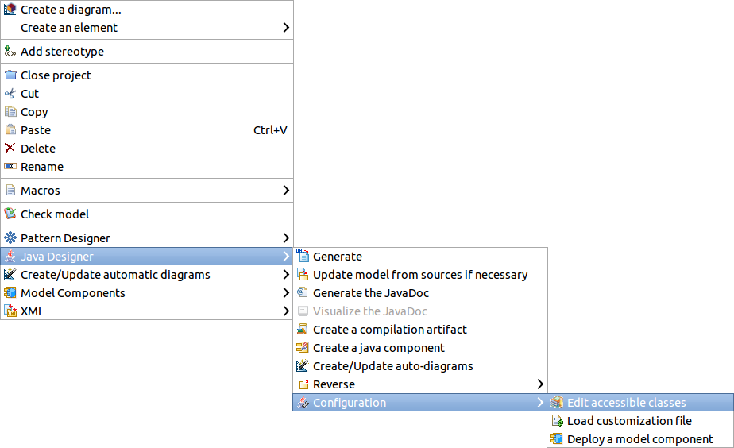

[[Project-classpath-types-not-found-and-external-classes]]

[[project-classpath-types-not-found-and-external-classes]]
= Project classpath, types not found and external classes

[[Available-source-files]]

[[available-source-files]]
=== Available source files

Usually a java project is composed of its own model and source files. During a reverse operation (or a round trip mode update), all those files are considered accessible: links are always created in the model to the corresponding classes.

*_Note:_* Each << Java Component >> can define its own source path, meaning a java project can use several source directories at the same time.

[[Defining-classpath]]

[[defining-classpath]]
=== Defining classpath

Sometimes, other elements are needed, which are essential to the project but do not actually belong to it. They usually correspond to external libraries (Jar files), or some other parts of the project not yet in the model.

All used JAR files must be declared in the project configuration. To define them, launch the “Java Designer/Configuration/Edit accessible classes” command on the project’s root package.

[[Type-reverse]]

[[type-reverse]]
=== Type reverse

When a reference to a type (extends link, parameter…) is found and needs to be reversed, Java Designer goes through several steps:

* Is this java type accessible in the project sources (.java) or in the configuration (.jar)?
** Not found means the type *won’t be searched in the model*: all references are replaced by tagged values, making the model partially inaccurate. The configuration may need to be completed, or the model to be generated. A “Type not found” warning is also added to the report.
** Type found in accessible classes, search in the model.
* Is this type found in the model?
** Yes, update its content.
** Not found in the model, it will be created. Is this type part of the files to reverse?
*** Yes, type is created in the model with all its content.
*** No, type is created in the model as an “External element”. An “External element creation” warning is also added to the report.

*_Note:_* An “External Element” is an empty placeholder. It is recommended either to update it, or to use a Model Component that contains it. The Java code of an external element is never generated.

[[footer]]
