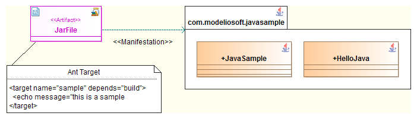

[[Creating-targets]]

[[creating-targets]]
= Creating targets

[[Creating-your-own-targets]]

[[creating-your-own-targets]]
=== Creating your own targets

ANT generation creates a set of predefined targets. If you need to add a specific target, you will need to create an “AntTarget” note and write your own target in it. In this case, these parts will be generated at the end of build.xml file, between markers.

[[footer]]
