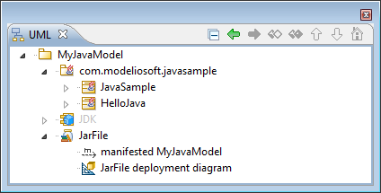
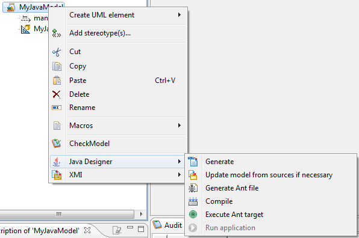

[[Generating-and-building-a-compilation-artifact]]

[[generating-and-building-a-compilation-artifact]]
= Generating and building a compilation artifact

In Modelio, you can now create a compilation artifact representing the jar file, simply by clicking on the “Create Java Designer element\Compilation artifact” command, in the context menu.

A deployment diagram is automatically created below the compilation artifact, in order to create a manifestation link to packages to be embedded within your jar file. Note that you can create packages with long names, as in the example shown in the figure below.

On this artifact, you can launch various commands, as shown in the figure below.

Key:

* : The “Generate” command will generate Java code for all the elements manifested by the artifact.
* image:images/Javadesigner-_javadeveloper_ant_generation_gen_build_ant_file_update.png[image]: The “Update model if necessary” command will reverse the Java code for all the elements manifested by the artifact.
* : The “Generate Ant file” command will generate the build.xml file in the Java workspace directory, to compile manifested elements.
* : The “Compile” command will launch the compilation by executing the ANT target “build”, to create .class files from your generated Java files.
* : The “Execute Ant target” command will open a window to present all the targets defined in the ANT file, so that you can select the target that is to be launched.
* : The “Run application” command is used to run a generated and compiled application from an ANT file.

The following table details predefined targets:

[cols=",",options="header",]
|====================================================
|Name |Label
|Init |Initialize the environment.
|Clean |Delete all files produced by the compilation.
|Resource |Manage resource files.
|Build |Compile the project.
|Archive |Create the jar file.
|RMI |Use rmic on corresponding classes.
|Javah |Use Javah on corresponding classes.
|====================================================

*_Note:_* You can specify that a jar file requires another jar file by creating a Usage link between them.

[[Customizing-the-location-of-generated-ANT-and-Jar-files]]

[[customizing-the-location-of-generated-ant-and-jar-files]]
=== Customizing the location of generated ANT and Jar files

ANT files are generated according to the artifacts that represent them in the model. By default, the ant file is generated in the compilation path using the name of the artifact followed by “.xml”. It is possible to specify an alternative path using a tagged value available on artifacts. This path must be absolute and must contain the ANT file name.

By default, the Jar file produced by the generated ANT file is created in the path defined by <<Javadesigner-_javadeveloper_customizing_java_generation_parameters.adoc#,the “Execution path” Java Designer parameter>> using the name of the artifact followed by “.jar”. This path can be modified at parameter level. Each Jar file can be produced with a different name and directory by using the “FileName” field found in the edition box of the compilation artifact in question.

[[footer]]
