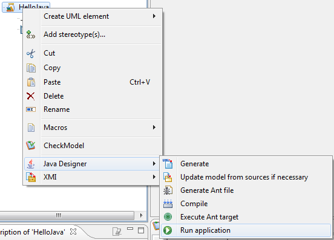

// Disable all captions for figures.
:!figure-caption:

// Hightlight code source and add the line number
:source-highlighter: coderay
:coderay-linenums-mode: table

[[Running-applications-from-a-compilation-artifact]]

[[running-applications-from-a-compilation-artifact]]
= Running applications from a compilation artifact

[[Before-starting]]

[[before-starting]]
=== Before starting

Before an application can be run from a compilation artifact, the application in question must have been compiled. The Jar file must also have been built.

The {JavaMainClass(< FullClassPath >)} tagged value is used to specify the main class of the application. This class will be used when the application is launched from Modelio.

[[Running-an-application-from-a-compilation-artifact]]

[[running-an-application-from-a-compilation-artifact]]
=== Running an application from a compilation artifact

To run an application from a compilation artifact, simply carry out the steps shown in the figure below.

*Steps:*

1.  Select the compilation artifact (in our example, the "HelloJava" jar file).
2.  In the "Java" tab, click on the icon. The application is then run.

[[footer]]
