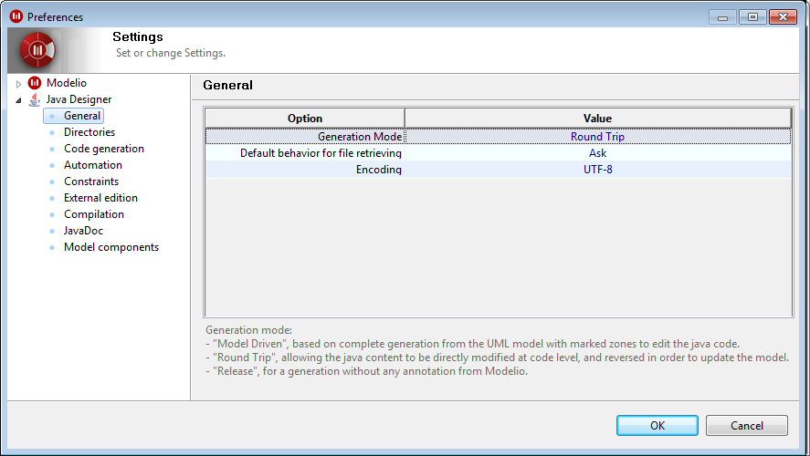

// Disable all captions for figures.
:!figure-caption:

// Hightlight code source and add the line number
:source-highlighter: coderay
:coderay-linenums-mode: table

[[Java-functioning-modes]]

[[java-functioning-modes]]
= Java functioning modes

[[Introduction]]

[[introduction]]
=== Introduction

Two functioning modes are available with Modelio Java Designer:

* Model-driven, which is based on the total generation of declarative code from the model itself. Application code (in other words, the programming of operations) is modeling through notes, or typing in marked zones. This mode does not concern reverse engineering.
* Round-trip, combining reverse engineering and code generation. Code is generated in exactly the same way as with the model driven mode. The user can freely modify the code nearby in the generated code or work in his favorite IDE. The model is updated when the "Update Source" command is run.
* Release, to generate the sources with no Modelio annotation.

[[Configuring-the-functioning-mode]]

[[configuring-the-functioning-mode]]
=== Configuring the functioning mode

The Java functioning mode is configured through the standard Modelio configuration interface, which is launched using the "Set module parameters" command. The generation mode is selected in the "Generation mode" field (as shown in the figure below).

[[footer]]
