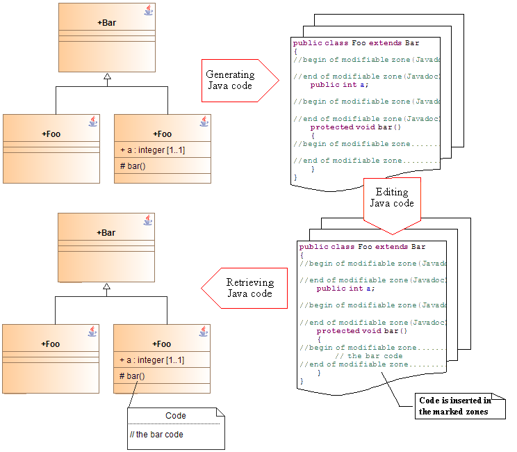

[[Model-driven-mode]]

[[model-driven-mode]]
= Model-driven mode

[[Principles-of-model-driven-engineering]]

[[principles-of-model-driven-engineering]]
=== Principles of model-driven engineering

Model-driven engineering is based on complete generation of declarative code from the UML model.

Marked zones are carefully inserted into the generated Java code, with each of these zones corresponding to a note that can be added to the model. Application code (virtually reduced to the programming of operations) is written in these marked zones (using with the aid of an external editor or an IDE).

Once the zones have been completed, their contents can be transferred back into the model in the form of corresponding notes. This operation can be carried out as many times as possible.

The model-driven engineering mode does not, therefore, involve reverse engineering. All “declarative” modifications, such as, for example, the addition of a new attribute, are in fact model modifications and as such must be carried out within Modelio, before subsequently regenerating the code.

Certain mechanisms exist to guarantee that the regenerated code does not overwrite any modifications made outside Modelio.

In this way, the entire application can be fine-tuned outside Modelio, as long as the model itself is not modified.

[[Advantages-of-the-model-driven-engineering-mode]]

[[advantages-of-the-model-driven-engineering-mode]]
=== Advantages of the model-driven engineering mode

The main advantage of this mode is that the code always corresponds to the model. In fact, it is only possible to modify declarations by modifying the model itself.

Other advantages are as follows:

* A relatively small modification to the model can lead to significant modifications at declarative code level. These code modifications are automatically taken into account by Modelio Java Designer.
* Total model/code consistency leads to up-to-date documentation, as well as other generation work products (metrics, SQL), which are consistent with the code at no additional cost.
* In the model, you can benefit from all services provided by Modelio Java Designer automation.

[[Drawbacks-of-the-model-driven-engineering-mode]]

[[drawbacks-of-the-model-driven-engineering-mode]]
=== Drawbacks of the model-driven engineering mode

The obvious drawback of the model-driven engineering mode is that you are obliged to come back to Modelio after every modification made to the model, in order to regenerate the code.

[[footer]]
