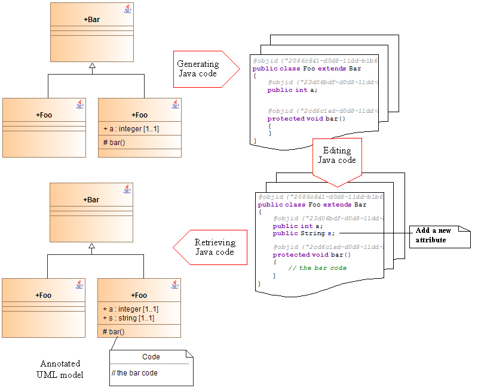

[[Round-trip-mode]]

[[round-trip-mode]]
= Round-trip mode

[[Principles-of-round-trip-engineering]]

[[principles-of-round-trip-engineering]]
=== Principles of round-trip engineering

Round-trip engineering is a functioning mode that combines code generation and reverse engineering. Code is generated in exactly the same way as with model driven engineering. Specific annotations are also generated, *@objid*, which are used during the reverse engineering phase to match code and model elements in Modelio.

Application code (virtually reduced to programming operations if the model is complete) is written in these marked zones (using an external editor or an IDE).

Unlike the model-driven mode, the round-trip mode allows the model to be directly modified at code level. The code is then fully reversed, in order to update the model.

In the example shown in the figure below, the String type attribute appears in the model.

[[Advantages-of-the-round-trip-engineering-mode]]

[[advantages-of-the-round-trip-engineering-mode]]
=== Advantages of the round-trip engineering mode

The main advantage of the round-trip mode is that modifications can be carried out within the code itself, with the model only being updated periodically.

[[Drawbacks-of-the-round-trip-engineering-mode]]

[[drawbacks-of-the-round-trip-engineering-mode]]
=== Drawbacks of the round-trip engineering mode

The fundamental disadvantage is:

* either that the code will very rapidly differ from the model
* or that the model returned will be physical and will lose its “overview”
* or a mix of the two previously described disadvantages

*_Note:_* See section <<Javadesigner-_javadeveloper_java_reverse_updating_model.adoc#,updating the UML model>> for more information about the @objid annotation.

[[footer]]
