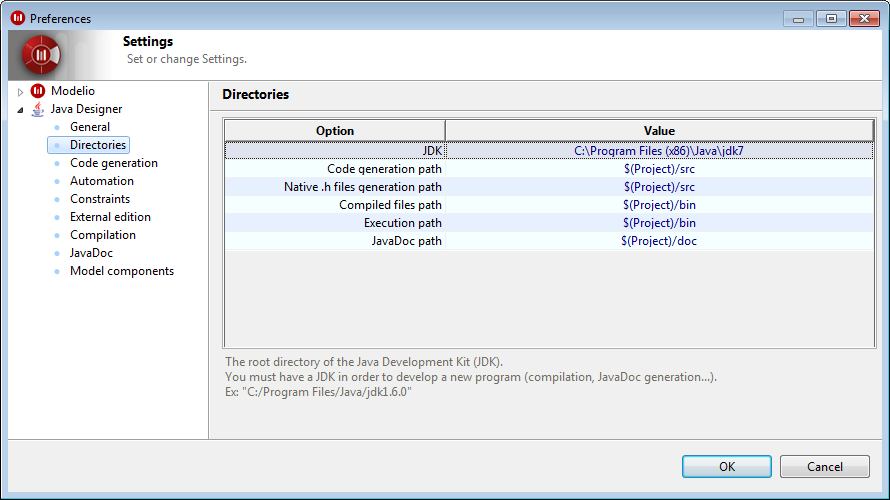

// Disable all captions for figures.
:!figure-caption:

// Hightlight code source and add the line number
:source-highlighter: coderay
:coderay-linenums-mode: table

[[Modelio-Java-Designer-parameters]]

[[modelio-java-designer-parameters]]
= Modelio Java Designer parameters

[[Overview]]

[[overview]]
=== Overview

The Modelio Java Designer parameter configuration window can be used to modify the behavior of the module.

To access the window used to configure Modelio Java Designer parameters, simply run the "Options/Set module parameters" command from the Modelio toolbar.

[[The-ldquoGeneralrdquo-set-of-parameters]]

[[the-general-set-of-parameters]]
=== The "General" set of parameters

image::images/Javadesigner-_javadeveloper_customizing_java_generation_parameters_param1.png[2]

*Keys:*

* *Generation mode*: indicates the mode selected for generation:

** *Model Driven*: based on complete generation from the UML model with marked zones to edit the Java code.
** *Round Trip*: allowing the Java content to be directly modified at code level and reversed in order to update the model.
** *Release*: for a generation without any annotation from Modelio.

* *Default behavior for file retrieving*: indicates what to do during generation if the file on disk has been modified since the last generation:

** *Ask*: for user confirmation.
** *Keep*: the model and overwrite the modified file.
** *Retrieve*: the file content.

* *Encoding*: indicates the encoding used for Java files during generation and reverse operations. The default value is UTF-8.

*Note:* For further information on the model-driven generation mode and the round-trip generation mode, please see "<<Javadesigner-_javadeveloper_choose_functional_mode_model_driven_mode.adoc#,Model-driven mode>>" and "<<Javadesigner-_javadeveloper_choose_functional_mode_round_trip_mode.adoc#,Round-trip mode>>".

[[The-ldquoDirectoriesrdquo-set-of-parameters]]

[[the-directories-set-of-parameters]]
=== The "Directories" set of parameters

*Keys:*

* *JDK*: indicates the root directory of the Java Development Kit (JDK). You must have a JDK in order to develop a new program (compilation, JavaDoc generation, ...).
* *Code generation path*: indicates the path of the .java files to generate.
* *Native .h file generation path*: indicates the path of the .h files generated by Javah.
* *Compiled files path*: indicates the path of the .class compiled from the .java files.
* *Execution path*: indicates the path where execution starts. It is also the path of the Jar files produced by the generated ANT file.
* *JavaDoc path*: indicates the path where the JavaDoc is generated.

[[The-ldquoCode-generationrdquo-set-of-parameters]]

[[the-code-generation-set-of-parameters]]
=== The "Code generation" set of parameters

*Keys:*

* *Customization file*: indicates where the default behaviour can be found in the "javaCustomizationFile" XML file, located in the module’s installation directory, into the workspace. Modelio Java Designer uses a specific XML file to define the mapping of base types, containers and the default creation of accessors.
* *Copyright file*: indicates a file’s content that will be added at the beginning of each generated class.It must contain the word "Copyright" to avoid beeing reversed.
* *Treat warnings as errors*: indicates if the specific Java consistency controls during generation are active. When active, generation is stopped for each file containing a warning, rather than ignoring it. For example, generate a class containing an attribute without type.
* *Do not generate read-only elements*: indicates whether or not Java source generation is deactivated for elements in read only mode. If this tickbox is checked, the Java file is not generated if the element has not been checked-out. However, generation is carried out recursively on all sub-elements. In this way, you can run the generation command on the root package in read only mode, in order to only generated elements that have been checked-out.
* *Generate read only files*: indicates all sources files generated from read only model elements will also be read only, to avoid unwanted modifications. You must generate again after getting a lock in order to make the according files writable.
* *Generate full name for used classes*: indicates that the fully qualified name should be used for used classes. For example, "java.io.File" instead of "File".
* *Generate "in" parameters as "final"*: indicates the "final" java keyword is generated for all parameters having an "in" access mode.

[[The-ldquoAutomationrdquo-set-of-parameters]]

[[the-automation-set-of-parameters]]
=== The "Automation" set of parameters

*Keys:*

* *Updating classes implementing an interface*: defines the behaviour of the automatic model update after a modification on an interface. With the Ask value, a dialog box is opened each time to propagate the update.
* *Accessor generation*: defines the global running of accessor generation in the model. This can be activated, deactivated, or smart. For the latter, accessors are only created for attributes that are not public.
* *Accessors for "public" elements*: declares the visibility of "get" type accessors for all public attributes.
* *Modifier for "public" elements*: declares the visibility of "set" type accessors for all public attributes.
* *Accessors for "protected" elements*: declares the visibility of "get" type accessors for all protected attributes.
* *Modifier for "protected" elements*: declares the visibility of "set" type accessors for all protected attributes.
* *Accessors for "package" elements*: declares the visibility of "get" type accessors for all package attributes.
* *Modifier for "package" elements*: declares the visibility of "set" type accessors for all package attributes.
* *Accessors for "private" elements*: declares the visibility of "get" type accessors for all private attributes.
* *Modifier for "private" elements*: declares the visibility of "set" type accessors for all private attributes.

*Note:* By default, attributes are created with a public accessor.

[[The-ldquoConstraintsrdquo-set-of-parameters]]

[[the-constraints-set-of-parameters]]
=== The "Constraints" set of parameters

*Keys:*

* *Generate pre/post-conditions*: indicates whether or not pre/post-conditions should be generated.
* *Generate invariants*: indicates whether or not invariants should be generated.
* *Invariants names*: indicates the name of the generated invariants methods.

*Note:* By default, invariants and conditions are not generated.

[[The-ldquoExternal-editionrdquo-set-of-parameters]]

[[the-external-edition-set-of-parameters]]
=== The "External edition" set of parameters

*Keys:*

* *Use external edition*: indicates whether or not an external editor should be used instead of the internal Modelio editor.
* *Command for invoking external editor*: indicates the command used to launch an editor to modify the generated code. Ignored if the external edition is deactivated.

[[The-ldquoCompilationrdquo-set-of-parameters]]

[[the-compilation-set-of-parameters]]
=== The "Compilation" set of parameters

*Keys:*

* *Compilation options*: indicates the compilation options (aimed at Java). See options for the "javac" tool for more info.
* *Generating .h files for native methods*: indicates whether or not .h files should be generated in native methods.
* *Application’s parameters*: indicates the parameters to give to the application when the run command is launched.

[[The-ldquoJavaDocrdquo-set-of-parameters]]

[[the-javadoc-set-of-parameters]]
=== The "JavaDoc" set of parameters

image::images/Javadesigner-_javadeveloper_customizing_java_generation_parameters_param8.png[12]

*Keys:*

* *Generate JavaDoc*: indicates whether or not Javadoc generation in your applications source is active.
* *Generate "description" notes as "Javadoc"*: indicates the processing of "description" type notes as "Javadoc" type notes. If checked, during reverse operations, the file’s Javadoc is incorporated into the model in the form of a "description" note.
* *Generation options*: indicates options to transmit to the javadoc JDK tool for the generation of Java documentation. See Javadoc options for more info.
* *Visualize JavaDoc after its generations*: indicates whether the default web browser from your system will be launched after each JavaDoc generation to visualized the produced files.

*Note:* For further details on documentation generation, please see "<<Javadesigner-_javadeveloper_java_doc_generation_overview.adoc#,Overview of Java documentation generation>>".

[[The-ldquoModel-componentsrdquo-set-of-parameters]]

[[the-model-components-set-of-parameters]]
=== The "Model components" set of parameters

image::images/Javadesigner-_javadeveloper_customizing_java_generation_parameters_param9.png[15]

*Keys:*

* *Add Java source files in model component*: indicates that you wish to include Java source files in a model component that you are packaging.
* *Add Jar files in model component*: indicates that you wish to include Java Archives in a model component that you are packaging.

[[footer]]
