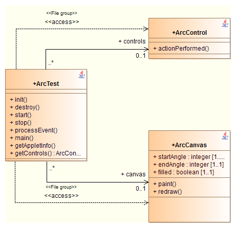
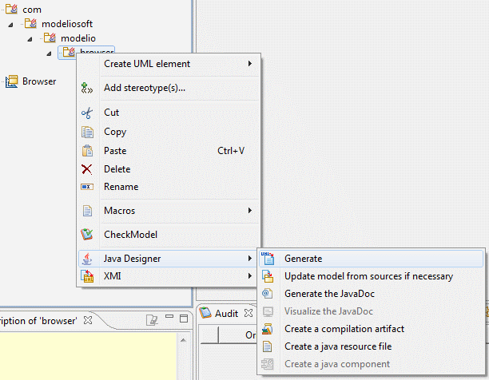

// Disable all captions for figures.
:!figure-caption:

// Hightlight code source and add the line number
:source-highlighter: coderay
:coderay-linenums-mode: table

[[Java-code-generation-functions]]

[[java-code-generation-functions]]
= Java code generation functions

[[Generating-several-classes-within-a-single-source-file]]

[[generating-several-classes-within-a-single-source-file]]
=== Generating several classes within a single source file

Java source files can contain several classes. To generate several classes in the same source file, the file’s main class is linked to the other files by an element import link stereotyped as JavaFileGroup.

A Java source file containing several classes is generated in the model in the following way:

The file’s main class is linked to the other files by an element import link stereotyped JavaFileGroup.

[[Java-generation-commands]]

[[java-generation-commands]]
=== Java generation commands

Modelio Java Designer generation provides several features related to generation.

*Keys:*

* : The "Generate" command will generate Java code for the class.
* : The "Edit" command will open an editor to modify the Java file content. When the editor is closed, the content of the file is automatically reversed.
* : The "Update model" command will reverse the Java code for the class.

[[footer]]
