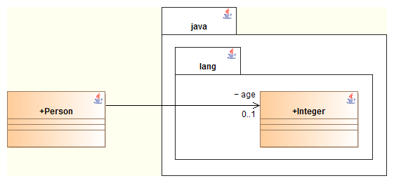
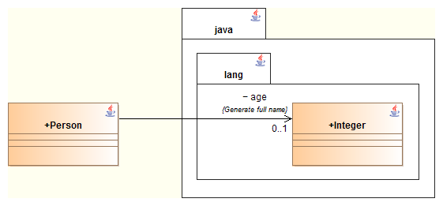
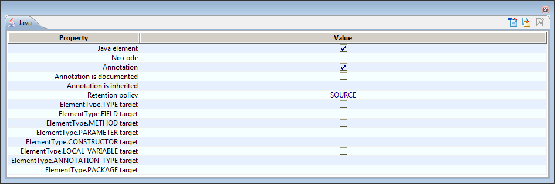

[[Overview-of-Java-code-generation]]

[[overview-of-java-code-generation]]
= Overview of Java code generation

[[Generating-types-and-accessors]]

[[generating-types-and-accessors]]
=== Generating types and accessors

By default, types are generated with their short name (without namespacing). For example, the following diagram:

will lead to the generation of the following code for the association of the “_Age_” role in the “_Person_” class :

....
1private Integer age;
....

However, it remains possible to generate the association type with its full name by setting the <<Javadesigner-_javadeveloper_generating_java_code_tagged_value_types.adoc#,\{JavaFullName} tagged value>> on the navigable association. This way, the following diagram:

will lead to the generation of this code :

....
1private java.lang.Integer age;
....

The above rule applies to the generation of navigable associations, attributes, method parameters, generalizations and implementations.

The generation of Java code is based on a UML model, extended by notes and tagged values specific to Java, in order to generate all the code for Java classes.

This generation can be parameterized to a high level, using the following mechanisms:

* Java generation parameters provide general generation options
* the <<Javadesigner-_javadeveloper_customizing_java_generation_customization_file.adoc#,Java customization file>> allows you to modify the mapping of types.

[[Defining-Java-annotations]]

[[defining-java-annotations]]
=== Defining Java annotations

Java annotations are defined in the “Java annotation definition” window.

This window, accessible by launching the “Edit properties” command on a class <<Javadesigner-_javadeveloper_generating_java_code_stereo_types.adoc#,stereotyped JavaAnnotation>>, defines all options available on the annotation definition.

[cols=",",options="header",]
|==================================================================================================================================
|Name |Function of the annotation
|Annotation is documented |Specifies whether the annotation is documented. Corresponds to the @Documented annotation type.
|Annotation is inherited |Specifies whether the annotation is documented. Corresponds to the @Inherited annotation type.
|Retention |Specifies the retention policy of the annotation. Corresponds to the @Retention annotation type.
|Annotation target |Specifies the types of elements where the annotation is applicable. Corresponds to the @Target annotation type.
|==================================================================================================================================

[[footer]]
