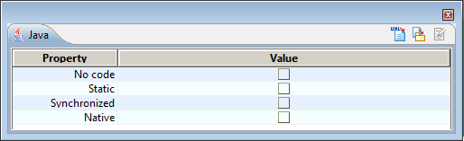

[[Java-Designer-property-view]]

[[java-designer-property-view]]
= Java Designer property view

[[Introduction]]

[[introduction]]
=== Introduction

The Java property view is used to enter or modify certain information relevant to Java generation on the element selected in Modelio, such as <<Javadesigner-_javadeveloper_generating_java_code_note_types.adoc#,notes>>, <<Javadesigner-_javadeveloper_generating_java_code_tagged_value_types.adoc#,tagged values>> or <<Javadesigner-_javadeveloper_generating_java_code_stereo_types.adoc#,stereotypes>>.

[[The-Java-Designer-property-view-on-a-package]]

[[the-java-designer-property-view-on-a-package]]
=== The Java Designer property view on a package

Key:

1.  The “Java element” field is used to add the << JavaPackage >> stereotype, indicating that the package is handled by Java.
2.  The “No code” field is used to add the \{JavaNoCode} tagged value, indicating that the package will not be generated.

The icons at the top of the window are used as follows:

* image:images/Javadesigner-_javadeveloper_intro_java_designer_property_view_generate.png[image]: This icon is used to launch Java generation.
* : This icon is used to update the model from the sources if necessary.
* : This icon is used to launch Javadoc generation.
* : This icon is used visualize the generated Javadoc in a web browser. Grayed if the Javadoc is not generated.

[[The-Java-Designer-property-view-on-a-class]]

[[the-java-designer-property-view-on-a-class]]
=== The Java Designer property view on a class

Key:

1.  The “Java element” field is used to add the << JavaClass >> stereotype, indicating that the class is handled by Java.
2.  The “No code” field is used to add the \{JavaNoCode} tagged value, indicating that the class will not be generated.
3.  The “Annotation” field is used to specify a Java 5 annotation.

The icons at the top of the window are used as follows:

* image:images/Javadesigner-_javadeveloper_intro_java_designer_property_view_generate.png[image]: This icon is used to launch Java generation.
* image:images/Javadesigner-_javadeveloper_intro_java_designer_property_view_edit.png[image]: This icon is used to edit generated Java code.
* : This icon is used to update the model from the sources if necessary.

[[The-Java-Designer-property-view-on-an-operation]]

[[the-java-designer-property-view-on-an-operation]]
=== The Java Designer property view on an operation

Key:

1.  The “No code” field is used to add the \{JavaNoCode} tagged value, indicating that the operation will not be generated.
2.  The “Static” tickbox indicates that the operation is “class”, in other words, shared by all its instances.
3.  The “Synchronized” tickbox adds the \{JavaSynchronize} tagged value to the operation, and indicates that the operation is synchronized.
4.  The “Native” tickbox adds the \{JavaNative} tagged value to the operation, and indicates that the operation is native.

The icons at the top of the window are used as follows:

* image:images/Javadesigner-_javadeveloper_intro_java_designer_property_view_generate.png[image]: This icon is used to launch Java generation.
* image:images/Javadesigner-_javadeveloper_intro_java_designer_property_view_edit.png[image]: This icon is used to edit generated Java code.
* : This icon is used to update the model from the sources if necessary.

[[The-Java-Designer-property-view-on-an-attribute]]

[[the-java-designer-property-view-on-an-attribute]]
=== The Java Designer property view on an attribute

Key:

1.  The “No code” field is used to add the \{JavaNoCode} tagged value, indicating that the attribute will not be generated.
2.  The “Java Property” tickbox is used to add the << JavaAttributeProperty >> stereotype, indicating that the getter ad setter created for this attribute won’t be created in the model, but generated.
3.  The “Wrapper” field is used to specify whether or not a basic type should be generated as a wrapper class. Available only for basic types with cardinality of 0..1.
4.  The “Getter” tickbox indicates whether or not an automatically updated getter exists for this attribute.
5.  The “Getter Visibility” combo box indicates the visibility of the generated getter, but only for Java Properties. The “Default” choice means the regular automation is applied to compute this visibility.
6.  The “Setter” tickbox indicates whether or not an automatically updated setter exists for this attribute.
7.  The “Setter Visibility” combo box indicates the visibility of the generated setter, but only for Java Properties. The “Default” choice means the regular automation is applied to compute this visibility.
8.  The “Static” tickbox indicates that the attribute is static.
9.  The “Final” tickbox adds the \{JavaFinal} tagged value to the attribute, and indicates that it is final.
10. The “Volatile” tickbox adds the \{JavaVolatile} tagged value to the attribute, and indicates that it is volatile.
11. The “Transient” tickbox adds the \{JavaTransient} tagged value to the attribute, and indicates that it is final.
12. The “Collection to use” field is used to add \{type(x)}, where x can be one of a group of strings in a list. This field specifies, in a package context of type Java 5, the collection to be used and the type of interface published for this attribute, within a framework of multiple cardinality.
13. The “Key” field is used to add the second parameter to the \{type} tagged value. It indicates the key type to use for container types like HashMap.
14. The “No init value” field is used to disable generation of the attribute’s initial value.
15. The “Template binding” field is used to specify parameters if the attribute’s datatype is a generic type.

The icons at the top of the window are used as follows:

* image:images/Javadesigner-_javadeveloper_intro_java_designer_property_view_generate.png[image]: This icon is used to launch Java generation.
* image:images/Javadesigner-_javadeveloper_intro_java_designer_property_view_edit.png[image]: This icon is used to edit generated Java code.
* : This icon is used to update the model from the sources if necessary.

[[The-Java-Designer-property-view-on-an-association]]

[[the-java-designer-property-view-on-an-association]]
=== The Java Designer property view on an association

Key:

1.  The “No code” tickbox is used to add the \{JavaNoCode} tagged value, indicating that the attribute will not be generated.
2.  The “Java Property” tickbox is used to add the << JavaAssociationEndProperty >> stereotype, indicating that the getter ad setter created for this association won’t be created in the model, but generated.
3.  The “Getter” tickbox indicates whether or not an automatically updated getter exists for this attribute.
4.  The “Getter Visibility” combo box indicates the visibility of the generated getter, but only for Java Properties. The “Default” choice means the regular automation is applied to compute this visibility.
5.  The “Setter” tickbox indicates whether or not an automatically updated setter exists for this attribute.
6.  The “Setter Visibility” combo box indicates the visibility of the generated setter, but only for Java Properties. The “Default” choice means the regular automation is applied to compute this visibility.
7.  The “Static” tickbox indicates that the attribute is static.
8.  The “Final” tickbox adds the \{JavaFinal} tagged value to the attribute, and indicates that it is final.
9.  The “Volatile” tickbox adds the \{JavaVolatile} tagged value to the attribute, and indicates that it is volatile.
10. The “Transient” tickbox adds the \{JavaTransient} tagged value to the attribute, and indicates that it is transient.
11. The “Collection to use” field is used to add \{type(x)}, where x can be one of a group of strings in a list. This field specifies, in a package context of type Java 5, the collection to be used and the type of interface published for this attribute, within a framework of multiple cardinality.
12. The “Key” field is used to add the second parameter to the \{type} tagged value. It indicates the key type to use for container types like HashMap.
13. The “No init value” field is used to disable the generation of the attribute’s initial value.
14. The “Template binding” field is used to specify parameters if the attribute’s datatype is a generic type.

The icons at the top of the window are used as follows:

* image:images/Javadesigner-_javadeveloper_intro_java_designer_property_view_generate.png[image]: This icon is used to launch Java generation.
* image:images/Javadesigner-_javadeveloper_intro_java_designer_property_view_edit.png[image]: This icon is used to edit generated Java code.
* : This icon is used to update the model from the sources if necessary.

[[The-Java-Designer-property-view-on-a-parameter]]

[[the-java-designer-property-view-on-a-parameter]]
=== The Java Designer property view on a parameter

Key:

1.  The “Wrapper” field is used to if a basic type must be generated as a wrapper class.
2.  The “Collection” field is used to add the \{type(x)}.
3.  The “Binding parameters for generics” field is used to specify parameters if the attribute’s datatype is a generic type.

The icons at the top of the window are used as follows:

* image:images/Javadesigner-_javadeveloper_intro_java_designer_property_view_generate.png[image]: This icon is used to launch Java generation.
* image:images/Javadesigner-_javadeveloper_intro_java_designer_property_view_edit.png[image]: This icon is used to edit generated Java code.
* : This icon is used to update the model from the sources if necessary.

[[The-Java-Designer-property-view-on-an-artifact]]

[[the-java-designer-property-view-on-an-artifact]]
=== The Java Designer property view on an artifact

image:images/Javadesigner-_javadeveloper_intro_java_designer_property_view_property_view7.png[image]

Key:

1.  The “Compilation artefact” field is used to add the << JarFile >> stereotype, indicating that this artifact is a compilation artifact.
2.  The “Main class” field is used to add the \{JavaMainClass} tagged value, indicating the namespacing of the main class in the project.

The icons at the top of the window are used as follows:

* image:images/Javadesigner-_javadeveloper_intro_java_designer_property_view_generate.png[image]: The “Generate” command will generate Java code for all the elements manifested by the artifact.
* : The “Update model if necessary” command will reverse the Java code for all the elements manifested by the artifact.
* image:images/Javadesigner-_javadeveloper_intro_java_designer_property_view_ant.png[image]: The “Generate Ant file” command will generate the build.xml file in the Java workspace directory, to compile manifested elements.
* : The “Compile” command will launch the compilation by executing the ANT target “build”, to create .class files from your generated Java files.
* image:images/Javadesigner-_javadeveloper_intro_java_designer_property_view_target.png[image]: The “Execute Ant target” command will open a window to present all the targets defined in the ANT file, so that you can select the target that is to be launched.
* : The “Run application” command is used to run a generated and compiled application from an ANT file.

[[footer]]
