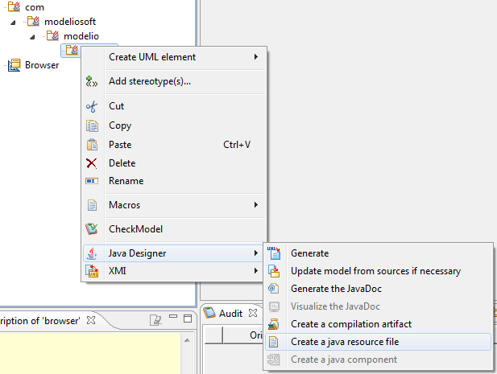

// Disable all captions for figures.
:!figure-caption:

// Hightlight code source and add the line number
:source-highlighter: coderay
:coderay-linenums-mode: table

[[Managing-resources]]

[[managing-resources]]
= Managing resources

With Modelio, you can manage your resources directly in the model. If you create a Java resource, with the filename field directed to the corresponding local file, on generation, the file is copied in the source path, in the directory corresponding to its container package.

On compilation, the resource file is copied from the source directory to the corresponding compiled files directory.

On jar file creation, the resource file is integrated into the jar file, in the corresponding directory.

Java resource files can be created on Java packages only. They are useful when modeling property files or images that are integrated directly into your packages.

[[footer]]
