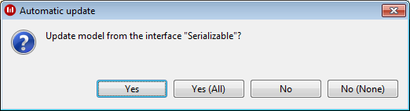

// Disable all captions for figures.
:!figure-caption:

// Hightlight code source and add the line number
:source-highlighter: coderay
:coderay-linenums-mode: table

[[Interface-implementation]]

[[interface-implementation]]
= Interface implementation

[[Overview]]

[[overview]]
=== Overview

This feature maintains consistency for operations in interfaces and their implementing classes. Operations can be automatically created when a class implements a new interface, including a redefinition link visible in the fast link editor.

When the name of a method in the interface changes, all the redefined methods in its child classes are updated. If you decide to create a new operation in your interface, the same operation can be created in the child classes.

[[Modifying-automatic-behavior]]

[[modifying-automatic-behavior]]
=== Modifying automatic behavior

The "Automation" group of <<Javadesigner-_javadeveloper_customizing_java_generation_parameters.adoc#,Modelio Java Designer parameters>> contains the different behaviors for the automatic update of classes implementing an interface.

* The "Always" value does the update automatically each time an interface is modified.
* The "Never" value deactivates the automatic model update.
* The modules default value, "Ask", making the following dialog box to appear after each update on an interface:

If you choose "Yes", the modifications made to the interface will be propagated to the implementing classes, whereas if you choose "No", the model will remain unmodified. "All" indicates your choice will be keeped for every other modified interface.

[[Launching-the-update-manually]]

[[launching-the-update-manually]]
=== Launching the update manually

Automatic interface implementation can also be launched manually on model elements.

On an interface:

* Open the contextual menu
* Launch the "Update classes implementing this interface" command

On a class implementing an interface:

* Open the contextual menu
* Launch the "Update from implemented interface" command

[[footer]]
