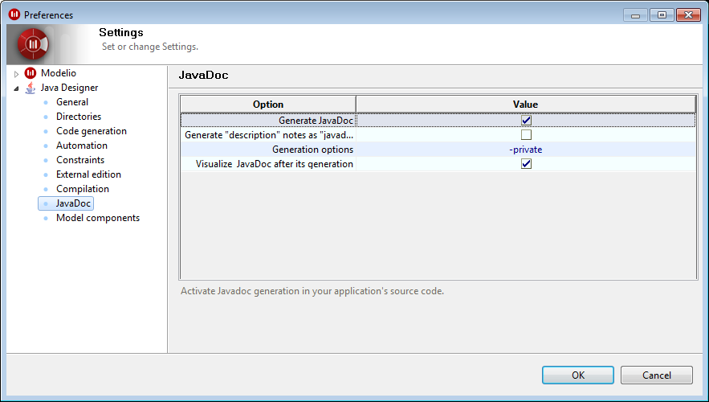

[[Java-documentation-generation-functions]]

[[java-documentation-generation-functions]]
= Java documentation generation functions

[[Generating-documentation]]

[[generating-documentation]]
=== Generating documentation

To generate the documentation for a package, run the “Java Designer/Generate JavaDoc” command.

[[Visualize-documentation]]

[[visualize-documentation]]
=== Visualize documentation

To display the documentation you have just generated, run the “Java Designer/Visualize JavaDoc” command. Your default HTML browser is automatically chosen.

[[Customizing-Javadoc-generation]]

[[customizing-javadoc-generation]]
=== Customizing Javadoc generation

Javadoc generation can be customized in the “JavaDoc” group <<Javadesigner-_javadeveloper_customizing_java_generation_parameters.adoc#,when configuring Modelio Java Designer parameters>>.

Key:

* “Generate JavaDoc”: This parameter is used to activate or deactivate JavaDoc generation in source files.
* “Generate "description” notes as “javadoc” “: This parameter lets you generate "description” notes found in the model as “Javadoc” notes. This can be useful when a general design model is converted into a Java-specific model.
* “Generation options”: This parameter defines the options given to the JavaDoc tool.

[[footer]]
