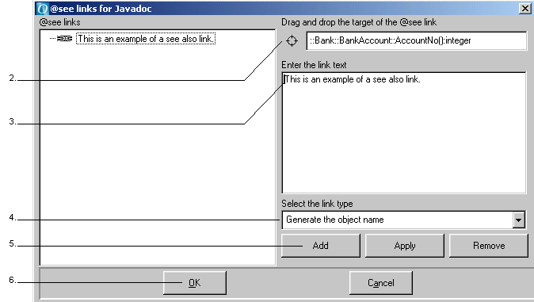
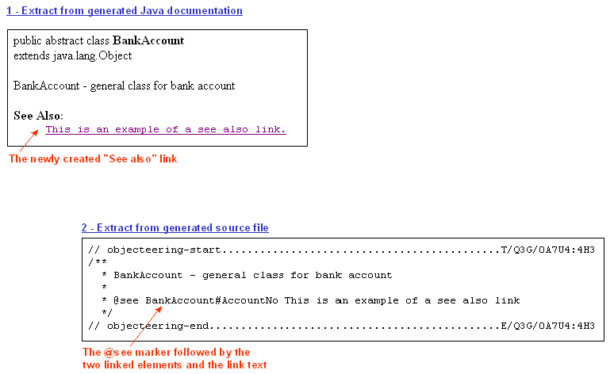

// Disable all captions for figures.
:!figure-caption:

// Hightlight code source and add the line number
:source-highlighter: coderay
:coderay-linenums-mode: table

[[Modeling-see-also-links]]

[[modeling-see-also-links]]
= Modeling see also links

[[Modeling-see-also-links-2]]

[[modeling-see-also-links-1]]
===== Modeling see also links

Javadoc @see markers are used to create "See also" links in the documentation created by Javadoc. Using Modelio Java Designer, these links are modeled through a dialog box which can be accessed via the context menu available on classes and operations.

By using the drag and drop feature, you can link a class or an operation to a package, class, operation, attribute or association. For every linked element, it is possible to add a description text.

Where operations are concerned, you can choose to display the type of the link. Possible types are:

....
     "Generate the object name": this is used to generate only the name of
....

the operation.

....
     "Generate the object name with argument types": this is used to
....

generate the name of the operation and the list of types of the parameters.

....
     "Generate the object name with argument types and names": this
....

generates the name of the operation and the list of types and names of the parameters.

The "Add", "Apply" and "Remove" buttons are used to add a new "See also" link, modify an existing "See also" link or delete an existing "See also" link.

The figure below shows an example of the creation of a new see also link.

.Creating a new "See also" link

*Steps:*

1.  Select the class or operation for which you want to create a see also link by right-clicking, and run the "Links for Javadoc generation" command.
2.  From the explorer, drag and drop the element you wish to link the selected class or operation to.
3.  Enter a description of the new see also link.
4.  Select the link type. By default, this is set to "Generate the object name".
5.  Click on "Add" to confirm your creation and add the new link to the left hand "@see links" column.
6.  Confirm by clicking on "OK".

The result of this operation is shown below.

.Extracts from generated Javadoc documentation and the generated source file

The information you entered in the "Enter the link text" zone of the "@see links for Javadoc" window is presented in the generated Java documentation. It is introduced by the "See Also" title, followed by the text entered.

The same information is present in the generated source file, preceded by first the @see and then by the linked elements.

[[footer]]
