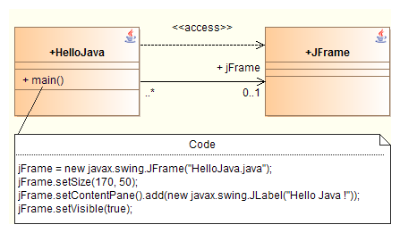
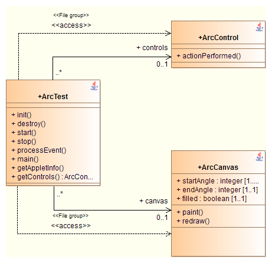

// Disable all captions for figures.
:!figure-caption:

// Hightlight code source and add the line number
:source-highlighter: coderay
:coderay-linenums-mode: table

[[Functioning-of-the-reverse-tool]]

[[functioning-of-the-reverse-tool]]
= Functioning of the reverse tool

[[Warning]]

[[warning]]
=== Warning

The Modelio Java Designer reverse tool makes it possible to parse Java source files and retrieve the model in Modelio. The source code does not have to be compilable, but it must use valid Java language syntax. The following example should be able to be reversed:

....
public class MyClass {
    int myAttribute = 10;
}
....

While this example should not be able to be reversed:

....
public class MyClass {
    int myAttribute = "10";
}
....

[[JavaModelio-correspondence]]

[[javamodelio-correspondence]]
=== Java/Modelio correspondence

Certain relationships between Java and Modelio are direct, whilst others require the creation of tagged values as shown in the list below.

[cols=",,",options="header",]
|==============================================
|Metaclass |Java modifier |Tagged value
|Attribute, AssociationEnd |final |\{JavaFinal}
|N/A |transient |\{JavaTransient}
|N/A |volatile |\{JavaVolatile}
|Operation |synchronized |\{JavaSynchronized}
|N/A |native |\{JavaNative}
|==============================================

The constructors of a Java class, which have the name as this class in Java, are created with the create stereotype in Modelio. As the passing mode of the parameters in Java is by reference, all the parameters of an operation, except the return parameter, have the In/Out type. A Java class may contain fields. Their type decides the reversed field that will be created as an attribute or an association. When the type is the primitive Java type or string, the field corresponds to an attribute. Otherwise, it is an association.

[[The-scope-of-the-Modelio-Java-Designer-reverse-tool]]

[[the-scope-of-the-modelio-java-designer-reverse-tool]]
=== The scope of the Modelio Java Designer reverse tool

Usually an application (or even a component or a single class) is composed of its own specific elements: its source files, and external elements such as JAR files or external classes.

We will call the application’s own elements "Elements to reverse". Most often, these elements will be systematically reversed.

Elements which are essential to the application but which do not actually belong to it will be called "External elements". The reverse of these elements is not complete. They will be reversed according to the needs at the time of the reverse of the "External elements".

Example:

....
 // File HelloJava.java
public class HelloJava {
    public static javax.swing.JFrame _jFrame_;

    public static void main(String[] args) {
        _jFrame_ = new javax.swing.JFrame("HelloJava.java");
        _jFrame_.setSize(170, 50);
        _jFrame_.getContentPane().add(new javax.swing.JLabel("Hello, Java !"));
        _jFrame_.setVisible(true);
    }

}
....

In this example, the element to reverse is the "HelloJava" class. The external element is the "JFrame" class. The Reverse tool will produce the model shown below.

The "HelloJava" class uses the "JFrame" class. The contents of the "JFrame" class are reversed into the model with the \{JavaExtern} tagged value. "JFrame" stems from the "rt.jar" external component (binary). This component contains many classes (more than 3000) that are not reversed because they are not used or referenced by "HelloWorld.java". This prevents the model from being overloaded with all the external elements.

[[Several-classes-in-the-same-source-file]]

[[several-classes-in-the-same-source-file]]
=== Several classes in the same source file

Java source files can contain several classes. This type of file is retrieved in the model as follows:

The main class in the file is linked to other files by a use link stereotyped JavaFileGroup.

*Note:* If one of the classes in the file is public, it will be considered to be the main class of the file being reversed. If there is no public class, the main class is one whose name is the same as that of the file. If no class with a name corresponding to the file name is found, the first class of the file is considered to be the main class.

[[Processing-comments-during-a-reverse]]

[[processing-comments-during-a-reverse]]
=== Processing comments during a reverse

The syntax of the Java language allows for great complexity in the positioning of comments in the source code.

Certain constructions cannot be reproduced in UML modeling. Comments present in the application source code are taken into account according to the following rules:

* All comments found before the package directive are incorporated into the model in the form of a "JavaTop" note in the main class of the file.
* All comments preceding an import directive are incorporated in a "description" note.
* All comments preceding a class or an interface, as well as a class element, are recuperated into the corresponding model in the form of a "description" or "Javadoc" note, depending on the case.
* If the format of the comment is / ... / , a "Javadoc" note is created. If the format is / ...*/ or // ... a "description" note is created.
* Every comment following an attribute declaration is recuperated into a "JavaInitValueComment" note.
* Each comment preceding a static block or an initialization block is recuperated into a "JavaMembers" note with the block that it precedes.
* Each comment preceding the closure of a class is recuperated in the form of a "JavaMembers" note.
* All comments at the end of the file are recuperated in the form of a "JavaBottom" note.
* Comments present in the body of a method are recuperated with the rest of the method.
* All other comments are ignored by the reverse.

The following example illustrates all the possibilities:

....
/*
 * This comment will be recuperated into a JavaTop note
 */

package p1.p2.p3;

/*
 * This comment will be recuperated into a description note
 * on the use link that corresponds to the import, if the
 * imported element can be found.
 */
import javax.swing.*;

/**
 *This comment will be recuperated into a Javadoc note on the class MyClass
 */
public class MyClass {
    /**
     * This comment will be recuperated into a Javadoc note on the attribute
     * myAtt1
     */
    JButton myAtt1;
    /*
     * This comment will be recuperated into a description note on the attribute
     * myAtt2
     */
    int myAtt2 = 10; /*
                     * This comment will be recuperated into a
                     * JavaInitValueComment note on myAtt2
                     */

    /**
     * This comment will be recuperated into a Javadoc note on the operation
     * method1
     */
    void myMethod1() {
        // This comment will be recuperated with the method body.
    }

    /*
     * This comment will be recuperated into a description note on the operation
     * method2
     */
    void myMethod2() {
        /* This comment will be recuperated with the method body. */
    }

    /**
     * This comment will be recuperated into a JavaMember note with the static
     * block
     */
    static {
        /*
         * This comment will be recuperated with body of the static block.
         */
    }
    /*
     * This comment will be recuperated into a JavaMember note with the
     * initialization block
     */
    {
        /*
         * This comment will be recuperated with body of the initialization
         * block.
         */
    }
}
/**
 * This comment will be recuperated into a JavaBottom note
 */
....

[[footer]]
