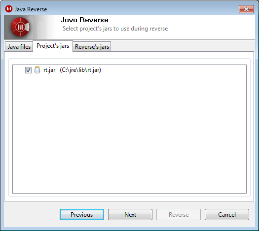

[[Launching-the-reverse-command]]

[[launching-the-reverse-command]]
= Launching the reverse command

[[Reversing-existing-classes]]

[[reversing-existing-classes]]
=== Reversing existing classes

Modelio Java Designer provides the user with the possibility of updating a class' modeling within a project. To do this, select “Update model from sources if necessary” on the class.

This command can also be launched on a package, updating all its child classes in the model.

[[Launching-the-reverse-wizard]]

[[launching-the-reverse-wizard]]
=== Launching the reverse wizard

To launch the Reverse wizard, please carry out the following steps:

* Right-click on the root package to display its context menu.
* Select the command “Java Designer/Reverse Java application from sources” to reverse a source file into the project.

[[Selecting-the-files-to-be-reversed]]

[[selecting-the-files-to-be-reversed]]
=== Selecting the files to be reversed

In the first window of the wizard, the path to the application to be reversed into the project should be entered. The central part of the page updates to display the directory’s content, in order to select the elements to reverse into the project.

Select the elements you wish to reverse by checking the associated tickbox.

The “Granularity” field is used to select the desired reversal level.

Three levels are available:

* Simple structural
* Complete structural
* Complete reverse (this reverse level is only available when reversing from sources)

For further details, please see “<<Javadesigner-_javadeveloper_java_reverse_three_reverse_levels.adoc#,Three reverse levels>>”.

Click on the “Next” button to proceed to the next step.

[[Reminder-of-the-projectrsquos-current-libraries]]

[[reminder-of-the-projects-current-libraries]]
=== Reminder of the project’s current libraries

The next window of the Wizard shows the current classpath of your project, as defined in the java module’s parameter. It is not modifiable here, but through <<Classpath_and_external_classes.adoc#-Defining-classpath.html#,classpath edition>>.

A jar can be ignored in the reverse by unchecking the associated tickbox.

Click on the “Next” button to proceed to the next step.

[[Selecting-the-application-libraries]]

[[selecting-the-application-libraries]]
=== Selecting the application libraries

The final window of the Wizard is used to specify the classpath of the application to be reversed.

*_Note:_* All libraries specified here won’t be added to your project’s configuration, but will be considered <<Classpath_and_external_classes.adoc#,accessible>> during the reverse phase.

Use the “Add” and “Remove” buttons to add or remove libraries (jar files), and the arrows to reorder them.

To go back to the previous step, click on the “Previous” button.

To launch the reverse operation, click on the “Reverse” button.

*_Note:_* A log file is automatically generated in the module’s installation directory (< Project_Path >/mda/JavaDesigner/reverse-log.html). This log file will be overwritten each time a new reverse is launched.

[[footer]]
