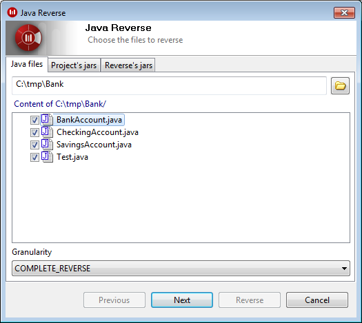

// Disable all captions for figures.
:!figure-caption:

// Hightlight code source and add the line number
:source-highlighter: coderay
:coderay-linenums-mode: table

[[Three-reverse-levels]]

[[three-reverse-levels]]
= Three reverse levels

[[Introduction-to-reversal-levels]]

[[introduction-to-reversal-levels]]
=== Introduction to reversal levels

The Modelio Java Designer reverse tool provides three reverse levels, each of which corresponds to a specific result in the produced project.

[[Simple-structural-reverse]]

[[simple-structural-reverse]]
=== Simple structural reverse

This reverse level is used to reverse only the packages and classes of the application.

This level makes it possible to use the reversed classes so as to:

* define attribute types
* define association types
* create specialization, implementation or use links from the classes to be reversed to the classes used.

This level is the fastest.

[[Complete-structural-reverse]]

[[complete-structural-reverse]]
=== Complete structural reverse

This level makes it possible to reverse not only the same elements as the "Simple-Structural" level, but also all the attributes, operations and associations of the reversed classes. However, operation contents and initializations (and code) are not reversed.

Reversed classes provide the same possibilities as with the "Simple- Structural" level, but in this level, it is also possible to:

* visualize the reversed classes' operations
* visualize attributes and associations
* overload the operations reversed into the project

[[Complete-reverse]]

[[complete-reverse]]
=== Complete reverse

Using this level of reverse makes it possible to reverse the application completely, including operation source code and attribute initialization.

This level makes it possible to create a project from an application developed outside Modelio Java Designer and to continue with its development within Modelio Modeler, thereby taking advantage of the Modelio Java Designer generation function.

For the three levels, comments describing the application’s elements are reversed when these exist.

For example, a Javadoc comment in a class will be reversed into the project from "SimpleStructural" level upwards, whereas operation comments will only be reversed from the "Complete-Structural" level.

The following table details the elements reversed into the project at each level.

[cols=",,,",options="header",]
|==================================================
| |Simple structural |Complete structural |Complete
|Packages |X |X |X
|Classes |X |X |X
|Comments |X |X |X
|Attributes | |X |X
|Attribute comments | |X |X
|Attribute initializations | | |X
|Associations | |X |X
|Association comments | |X |X
|Association initializations | | |X
|Operations | |X |X
|Operation comments | |X |X
|Operation code | | |X
|==================================================

*Note:* "X" indicates that the element is retrieved during the reverse operation.

[[footer]]
