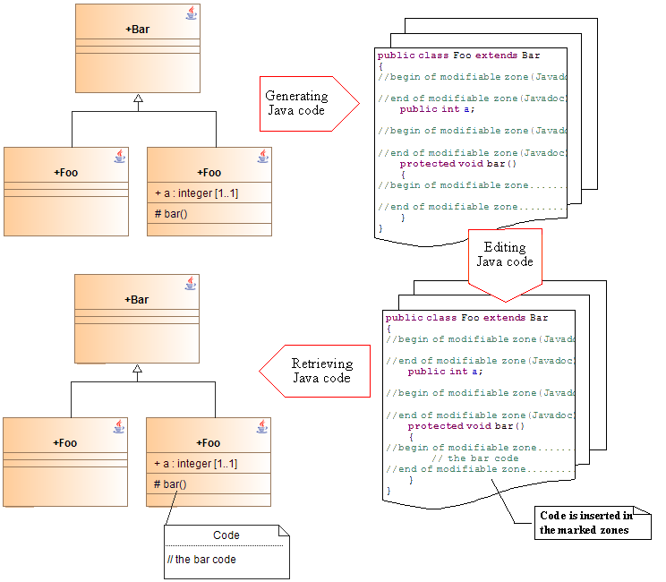
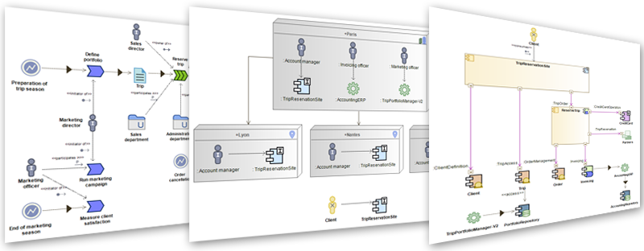

# Modelio Modules

Modules are the means of defining, implementing and deploying extensions for Modelio. They can be seen as the equivalent of extensions for Firefox.
They are used to extend and adapt Modelio Modeler by providing additional functionalities and services that meet your specific needs.The current repository contains source code of several open source modules provided with Modelio.

Java Designer
-------------
Modelio Java Designer generates a Java application from a Modelio model, and also manages the generation of its documentation. Modelio Java Designers automatic model completion features makes your modeling easier by managing accessors and implementing interfaces methods.During the modeling phase, a reverse feature is provided to enable you to use classes in existing libraries, especially the JDK (Java Development Kit).

TogafArchitect
--------------
TOGAF is a framework for EA which provides a comprehensive approach to the design, planning, implementation, and governance of an enterprise information architecture. TOGAF is a registered trademark of The Open Group. TOGAF is a high level and holistic approach to design, which is typically modeled at four levels: Business, Application, Data, and Technology. As an open standard, TOGAF is widely adopted to support EA.

