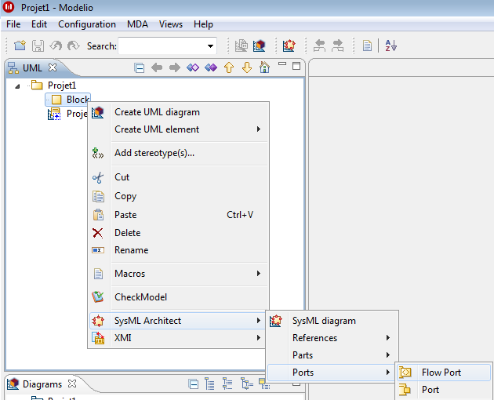

The commands available on a Block are as follows:

[[Commands-on-a-Block]]

[[commands-on-a-block]]
Commands on a Block

*image:images/Sysml-architect_commands-block_image009.png[image] SysML diagram*: Launch the SyML diagram creation wizard.

*Distributed property*: Creates a Distributed Property.

*image:images/Sysml-architect_commands-block_image020.png[image]Reference*: Creates an Reference.

*image:images/Sysml-architect_commands-block_image021.png[image]Connector property*: Creates a Connector Property.

*Participant property*: Creates a Participant Property.

*image:images/Sysml-architect_commands-block_image023.png[image]Part*: Creates a Part.

*Flow port*: Creates a Flow Port.

*Port*: Creates a Port.

[[footer]]
