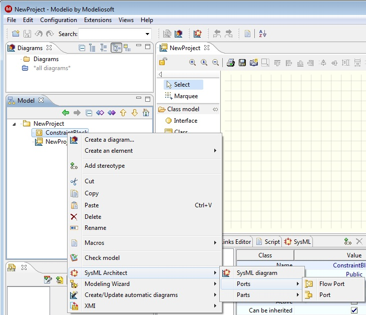

The commands available on a Constraint Block are as follows:

[[Commands-on-a-Constraint-Block]]

[[commands-on-a-constraint-block]]
Commands on a Constraint Block

* SysML diagram*: Launch the SyML diagram creation wizard.

*image:images/Sysml-architect_commands-constraintblock_image024.png[image]Flow port*: Creates a FlowPort.

*image:images/Sysml-architect_commands-constraintblock_image025.png[image]Port*: Creates a Port.

*image:images/Sysml-architect_commands-constraintblock_image023.png[image]Part*: Creates a Part or an Instance.

[[footer]]
