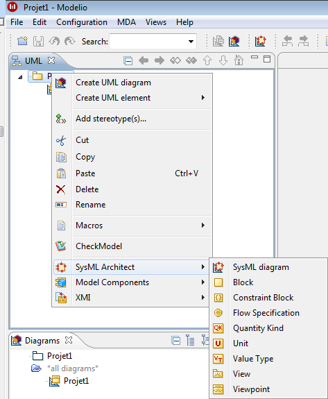

The following commands are accessible by right-clicking on a Package element in the model browser.

[[SysML-element-creation-commands-available-on-a-Package]]

[[sysml-element-creation-commands-available-on-a-package]]
SysML element creation commands available on a Package

* SysML diagram*: Launch the SyML diagram creation wizard.

*Block*: Creates a Block.

*Constraint block*: Creates a ConstraintBlock.

*Flow specification*: Creates a FlowSpecification.

*Quantity kind*: Creates a QuantityKind.

*Unit*: Creates a Unit.

*Value type*: Creates a ValueType.

*View*: Creates a View.

*Viewpoint*: Creates Viewpoint.

[[footer]]
