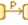

[[SysML-Activity-diagrams]]

[[sysml-activity-diagrams]]
= SysML Activity diagrams

SysML Activity diagrams are dedicated to specifying the flow of inputs/outputs and control, including sequences and conditions for activities.

Most of the elements required for modeling the activity behavior of a Block element come from UML Activity diagrams. SysML adds some further extensions, such as support of continuous flow modeling.

[[Palette]]

[[palette]]
== Palette

In the following list we show only the activities elements added by the SysML specification.

*Continuous*: Creates a Continuous parameter.

* Discrete*: Creates a Discrete parameter.

*Optional*: Creates an Optional parameter.

*Rate*: Creates a Rate parameter.

*Continuous*: Creates a Continuous activity edge between two activity nodes.

*Discrete*: Creates a Discrete activity edge between two activity nodes.

*Probability*: Creates a Probability activity edge between two activity nodes.

*Rate*; Creates a Rate activity edge between two activity nodes.

*image:images/Sysml-architect_diagram-activity_image059.png[image]Item Flow*: Creates an Item Flow.

*image:images/Sysml-architect_diagram-activity_image071.png[image]Problem*: Creates a Problem note.

*image:images/Sysml-architect_diagram-activity_image072.png[image]Rationale*: Creates a Rationale note.

[[Example]]

[[example]]
== Example

The following example is extracted from the MIWG Test case list and implemented in the SysML Architect module.

[[SysML-Activity-modeling-use-case]]

[[sysml-activity-modeling-use-case]]
SysML Activity modeling use case

[[footer]]
