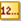
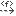

[[Block-diagrams]]

[[block-diagrams]]
= Block diagrams

Block diagrams are used to design system composition in terms of blocks and the relations between them, such as associations, generalizations, and dependencies. Blocks can be placed in packages to separate domains.

[[Palette]]

[[palette]]
== Palette

*Block*: Creates a Block.

*ConstraintBlock*: Creates a ConstraintBlock. ConstraintBlocks are an extension of the Block concept.

*FlowSpecification*: Creates a FlowSpecification.

*image:images/Sysml-architect_diagram-block_image021.png[image]Connector property*: Creates a ConnectorProperty. This command is only available for Block elements.

*Contraint property*: Creates a ConstraintProperty. This command is only available for ConstraintBlock elements.

*image:images/Sysml-architect_diagram-block_image022.png[image]Participant property*: Creates a ParticipantProperty. This command is only available for Block elements.

*image:images/Sysml-architect_diagram-block_image023.png[image]Part*: Creates an Instance inside a Package or creates a Part inside a Classifier.

*image:images/Sysml-architect_diagram-block_image019.png[image]Distributed property*: Creates a DistributedProperty. A DistributedProperty can only be created inside Block elements.

*image:images/Sysml-architect_diagram-block_image043.png[image]Flow property*: Creates a FlowProperty. A DistributedProperty can only be created inside Block or FlowSpecification elements.

*Attribute*: Creates an Attribute.

*image:images/Sysml-architect_diagram-block_image044.png[image]Operation*: Creates an Operation.

*Associations*: Creates an Association link.

*Aggregation*: Creates an Association link of kind "aggregation".

*Composition*: Creates an Association link of kind "composition".

*SmartGeneralization*: Creates a Generalization or an InterfaceRealization link.

Note: If the target element is a Class, a Generalization link will be created. If the target element is an Interface, this command creates an InterfaceRealization link.

*image:images/Sysml-architect_diagram-block_image049.png[image]Generalization link*: Creates a Generalization link.

*InterfaceRealization link*: Create an InterfaceRealization link.

*image:images/Sysml-architect_diagram-block_image015.png[image]ValueType*: Creates a ValueType.

*DataType*: Creates a DataType.

*Enumeration*: Creates an Enumeration.

*EnumerationLiteral*: Creates an EnumerationLiteral.

*ClassAssociation*: Creates a ClassAssociation.

*image:images/Sysml-architect_diagram-block_image024.png[image]FlowPort*: Creates a FlowPort .

*image:images/Sysml-architect_diagram-block_image025.png[image]Port*: Creates a Port.

*image:images/Sysml-architect_diagram-block_image055.png[image]ProvidedInterface*: Creates a ProvidedInterface.

*RequiredInterface*: Creates a RequiredInterface.

*image:images/Sysml-architect_diagram-block_image013.png[image]QuantityKind*: Creates a QuantityKind.

*image:images/Sysml-architect_diagram-block_image014.png[image]Unit*: Creates a Unit.

*image:images/Sysml-architect_diagram-block_image023.png[image]Part*: Creates an Instance or a Part inside a Classifier.

*image:images/Sysml-architect_diagram-block_image057.png[image]AttributeLink*: Creates an AttributeLink.

*image:images/Sysml-architect_diagram-block_image058.png[image]Delegate*: Creates a delegate connector.

*image:images/Sysml-architect_diagram-block_image058.png[image]Link*: Creates a Link.

*image:images/Sysml-architect_diagram-block_image059.png[image]Item flow*: Creates an ItemFlow.

*Information Flow*: Creates an Information flow

*image:images/Sysml-architect_diagram-block_image061.png[image]Realized Information Flow*: Creates a realized information flow

*Information Item*: Creates an Information Item

*image:images/Sysml-architect_diagram-block_image063.png[image]Allocate*: Creates an Allocate dependency.

*image:images/Sysml-architect_diagram-block_image064.png[image]Conform*: Creates a Conform dependency.

*image:images/Sysml-architect_diagram-block_image065.png[image]Copy*: Creates a Copy dependency.

*image:images/Sysml-architect_diagram-block_image066.png[image]Refine*: Creates a Refine dependency.

*image:images/Sysml-architect_diagram-block_image067.png[image]Satisfy*: Creates a Satisfy dependency.

*image:images/Sysml-architect_diagram-block_image068.png[image]Verify*: Creates a Verify dependency.

*image:images/Sysml-architect_diagram-block_image069.png[image]Dependency*: Creates a Dependency.

**: Creates a Traceability link.

*image:images/Sysml-architect_diagram-block_image069.png[image]Related diagram link*: Create a link between an element and its related diagram.

*image:images/Sysml-architect_diagram-block_image071.png[image]Problem*: Creates a Problem note.

*image:images/Sysml-architect_diagram-block_image072.png[image]Rationale*: Creates a Rationale note.

*image:images/Sysml-architect_diagram-block_image073.png[image]Note*: Creates a Note.

*image:images/Sysml-architect_diagram-block_image074.png[image]Constraint*: Creates a Constraint.

[[Example]]

[[example]]
== Example

The following example is extracted from the SysML 1.2 specification and implemented in the SysML Architect module.

[[Block-modeling-use-case]]

[[block-modeling-use-case]]
Block modeling use case

[[footer]]
