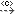
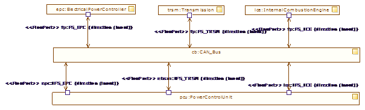

[[Internal-block-diagrams]]

[[internal-block-diagrams]]
= Internal block diagrams

Internal Block diagrams are dedicated to modeling the internal structure of Blocks in terms of properties and the relationships between properties.

[[Palette]]

[[palette]]
== Palette

*Connector property*: Creates a ConnectorProperty. This command is only available for Block elements.

*Contraint property*: Creates a ConstraintProperty. This command is only available for ConstraintBlock elements.

*image:images/Sysml-architect_diagram-internalblock_image022.png[image]Participant property*: Creates a ParticipantProperty. This command is only available for Block elements.

*Part*: Creates an Instance inside a Package or create a Part inside a Classifier.

*image:images/Sysml-architect_diagram-internalblock_image019.png[image]Distributed property*: Creates a DistributedProperty. A DistributedProperty can only be created inside Block elements.

*image:images/Sysml-architect_diagram-internalblock_image043.png[image]Flow property*: Creates a FlowProperty. A DistributedProperty can only be created inside Block or FlowSpecification elements.

*Attribute*: Creates an Attribute.

*Operation*: Creates an Operation.

*Delegate*: Creates a delegate connector.

*Link*: Creates a Link.

*image:images/Sysml-architect_diagram-internalblock_image024.png[image]FlowPort*: Creates a FlowPort.

*image:images/Sysml-architect_diagram-internalblock_image025.png[image]Port*: Creates a Port.

*ProvidedInterface*: Creates a ProvidedInterface.

*RequiredInterface*: Creates a RequiredInterface.

*image:images/Sysml-architect_diagram-internalblock_image059.png[image]Item Flow*: Creates an Item Flow.

*Information Flow*: Creates an Information flow

*Realized Information Flow*: Creates a realized information flow

*Information Item*: Creates an Information Item

*image:images/Sysml-architect_diagram-internalblock_image063.png[image]Allocation*: Creates an Allocate dependency.

*Conform*: Creates a Conform dependency.

*Copy*: Creates a Copy dependency.

*image:images/Sysml-architect_diagram-internalblock_image066.png[image]Refine*: Creates a Refine dependency.

*image:images/Sysml-architect_diagram-internalblock_image067.png[image]Satisfy*: Creates a Satisfy dependency.

*image:images/Sysml-architect_diagram-internalblock_image068.png[image]Verify*: Creates a Verify dependency.

*image:images/Sysml-architect_diagram-internalblock_image069.png[image]Dependency*: Creates a Dependency .

*image:images/Sysml-architect_diagram-internalblock_image070.png[image]*: Creates a Traceability link.

*image:images/Sysml-architect_diagram-internalblock_image069.png[image]Related diagram link*: Create a link between an element and its related diagram.

*image:images/Sysml-architect_diagram-internalblock_image071.png[image]Problem*: Creates a Problem note.

*image:images/Sysml-architect_diagram-internalblock_image072.png[image]Rationale*: Creates a Rationale note.

*Note*: Creates a Note.

*image:images/Sysml-architect_diagram-internalblock_image074.png[image]Constraint*: Creates a Constraint.

[[Example]]

[[example]]
== Example

This example is extracted from the SysML specification and implemented in the SysML Architect module.

[[Internal-Block-modeling-use-case]]

[[internal-block-modeling-use-case]]
Internal Block modeling use case

[[footer]]
