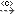

[[Package-diagrams]]

[[package-diagrams]]
= Package diagrams

Package diagrams are dedicated to organizing or grouping the model into views and viewpoints.

[[Palette]]

[[palette]]
== Palette

The following commands list highlights only those SysML elements present in the package diagram palette.

*View*: Creates a View.

*Viewpoint*: Creates a Viewpoint.

*QuantityKind*: Creates a QuantityKind.

*Unit*: Creates a Unit.

*Conform*: Creates a Conform dependency.

*image:images/Sysml-architect_diagram-package_image059.png[image]Item Flow*: Creates an Item Flow.

*Problem*: Creates a Problem note.

*image:images/Sysml-architect_diagram-package_image072.png[image]Rationale*: Creates a Rationale note.

[[Example]]

[[example]]
== Example

This example is extracted from the SysML 1.2 specification and implemented in the SysML Architect module.

[[Package-modeling-use-case]]

[[package-modeling-use-case]]
Package modeling use case

[[footer]]
