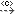
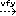
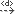
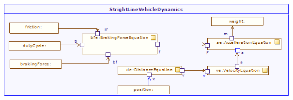

[[Parametric-diagrams]]

[[parametric-diagrams]]
= Parametric diagrams

Parametric diagrams are used to express constraints (equations) existing between value properties. They are a restricted form of internal block diagram and represent constrained use in a particular context.

The most important elements are Constraint Properties and FlowPorts composing the ConstraintBlock, as well as their relationships modeled using Connectors or Item Flow links.

[[Palette]]

[[palette]]
== Palette

*image:images/Sysml-architect_diagram-parametric_image021.png[image]Connector property*: Creates a ConnectorProperty.

*Contraint property*: Creates a ConstraintProperty.

*Participant property*: Creates a ParticipantProperty.

*image:images/Sysml-architect_diagram-parametric_image023.png[image]Part*: Creates an Instance or a Part inside a Classifier.

*image:images/Sysml-architect_diagram-parametric_image019.png[image]Distributed property*: Creates a DistributedProperty.

*Flow property*: Creates a FlowProperty.

*Attribute*: Creates an Attribute.

*AttributeLink*: Creates an AttributeLink.

*image:images/Sysml-architect_diagram-parametric_image058.png[image]Delegate*: Creates a delegate connector.

*image:images/Sysml-architect_diagram-parametric_image058.png[image]Link*: Creates a Link.

*FlowPort*: Creates a FlowPort.

*image:images/Sysml-architect_diagram-parametric_image025.png[image]Port*: Creates a Port.

*ProvidedInterface*: Creates a ProvidedInterface.

*RequiredInterface*: Creates a RequiredInterface.

*Item Flow*: Creates an Item Flow.

*image:images/Sysml-architect_diagram-parametric_image060.png[image]Information Flow*: Creates an Information flow

*image:images/Sysml-architect_diagram-parametric_image061.png[image]Realized Information Flow*: Creates a realized information flow

*Information Item*: Creates an Information Item

*image:images/Sysml-architect_diagram-parametric_image063.png[image]Allocation*: Creates an Allocate dependency.

*Conform*: Creates a Conform dependency.

*image:images/Sysml-architect_diagram-parametric_image065.png[image]Copy*: Creates a Copy dependency.

*image:images/Sysml-architect_diagram-parametric_image066.png[image]Refine*: Creates a Refine dependency.

*image:images/Sysml-architect_diagram-parametric_image067.png[image]Satisfy*: Creates a Satisfy dependency.

*Verify*: Creates a Verify dependency.

*Dependency*: Creates a Dependency .

*Traceability*: Creates a Traceability link.

*Related diagram link*: Create a link between an element and its related diagram.

*image:images/Sysml-architect_diagram-parametric_image071.png[image]Problem*: Creates a Problem note.

*image:images/Sysml-architect_diagram-parametric_image072.png[image]Rationale*: Creates a Rationale note.

*image:images/Sysml-architect_diagram-parametric_image073.png[image]Note*: Creates a Note.

*Constraint*: Creates a Constraint.

[[Example]]

[[example]]
== Example

The following example is extracted from the literature and implemented in the SysML ARchitect module.

[[Parametric-diagram-use-case]]

[[parametric-diagram-use-case]]
Parametric diagram use case

[[footer]]
