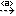
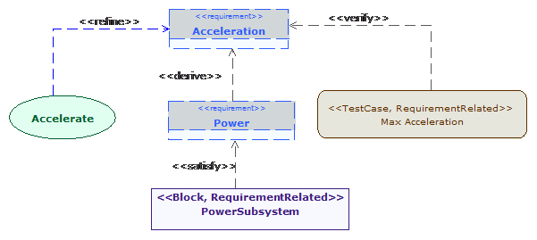

[[SysML-Requirement-diagrams]]

[[sysml-requirement-diagrams]]
= SysML Requirement diagrams

SysML Requirement diagrams are dedicated to modeling system requirements, in other words, the capabilities or conditions that must be fulfilled. Requirement relationships related to other requirements as to other model elements can be also specified using this type of diagram.

[[Palette]]

[[palette]]
== Palette

The following list represents the elements available in SysML requirement diagrams.

*RequirementContainer*: Creates a Requirement Container.

*Requirement*: Creates a Requirement.

*Allocate*: Creates an Allocate dependency.

*Part*: Creates a Part dependency.

*Derive*: Creates a Derive link.

*image:images/Sysml-architect_diagram-requirement_image065.png[image]Copy*: Creates a Copy dependency.

*image:images/Sysml-architect_diagram-requirement_image067.png[image]Satisfy*: Creates a Satisfy dependency.

*image:images/Sysml-architect_diagram-requirement_image068.png[image]Verify*: Creates a Verify dependency.

*Refine*: Creates a Refine dependency.

*Trace*: Creates a Traceability link.

*image:images/Sysml-architect_diagram-requirement_image071.png[image]Problem*: Creates a Problem note.

*image:images/Sysml-architect_diagram-requirement_image072.png[image]Rationale*: Creates a Rationale note.

*Note*: Creates a Note.

*image:images/Sysml-architect_diagram-requirement_image074.png[image]Constraint*: Creates a Constraint.

[[Example]]

[[example]]
== Example

The following example is extracted from the http://www.omgwiki.org/model-interchange/doku.php[MIWG] test case list and implemented in the SysML Architect module.

[[Requirement-modeling-use-case]]

[[requirement-modeling-use-case]]
Requirement modeling use case

[[footer]]
