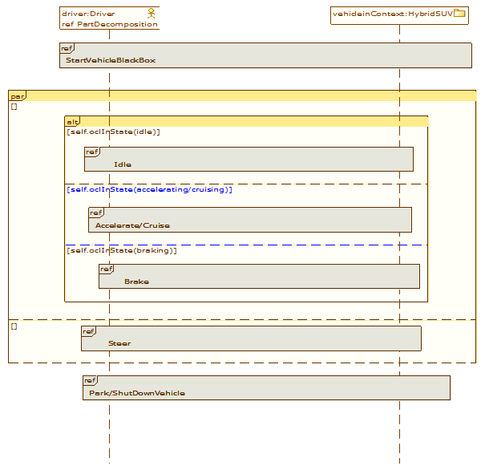

[[SysML-Sequence-diagrams]]

[[sysml-sequence-diagrams]]
= SysML Sequence diagrams

SysML Sequence diagrams are dedicated to specifying the flow of control between actors and blocks, or between parts of a system. They represent the sequence of sending and receiving messages between the considered entities through the lifelines exposed.

[[Palette]]

[[palette]]
== Palette

In the following list only those elements added to sequence diagrams by theSysML specification are detailed.

*image:images/Sysml-architect_diagram-sequence_image059.png[image]Item Flow*: Creates an Item Flow.

*image:images/Sysml-architect_diagram-sequence_image071.png[image]Problem*: Creates a Problem note.

*image:images/Sysml-architect_diagram-sequence_image072.png[image]Rationale*: Creates a Rationale note.

[[Example]]

[[example]]
== Example

The following example is extracted from the SysML specification and implemented in the SysML Architect module.

[[SysML-Sequence-modeling-use-case]]

[[sysml-sequence-modeling-use-case]]
SysML Sequence modeling use case

[[footer]]
