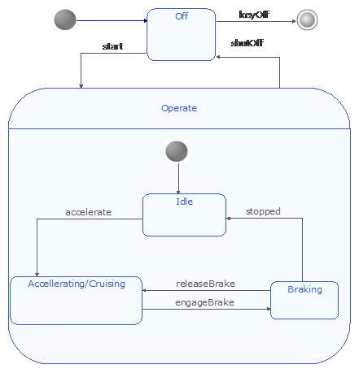

[[SysML-State-diagrams]]

[[sysml-state-diagrams]]
= SysML State diagrams

SysML State diagrams describe the behavior of an element as a succession of state linked by transitions.

Most of the elements required for modeling the state machine behavior of a Block element come from UML state diagrams.

[[Palette]]

[[palette]]
== Palette

In the following list only those elements added to state diagrams by the SysML specification are detailed.

*image:images/Sysml-architect_diagram-state_image071.png[image]Problem*: Creates a Problem note.

*image:images/Sysml-architect_diagram-state_image072.png[image]Rationale*: Creates a Rationale note.

[[Example]]

[[example]]
== Example

The following example is extracted from the SysML 1.2 specification and implemented in the SysML Architect module.

[[footer]]
