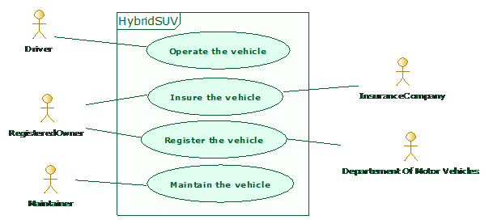

[[SysML-Use-case-diagrams]]

[[sysml-use-case-diagrams]]
= SysML Use case diagrams

SysML Use case diagrams describe how a system is used by its environment (external actors). The system provides services which are used by the actors in order to realize their goals. Use case diagrams are often seen as a picture of the list of functionalities provided by the system and the set of interacting user types or external systems.

[[Palette]]

[[palette]]
== Palette

In the following listonly those elements added to use case diagrams by the SysML specification are detailed.

*Item Flow*: Creates an Item Flow.

*image:images/Sysml-architect_diagram-usecase_image071.png[image]Problem*: Creates a Problem note.

*Rationale*: Creates a Rationale note.

[[Example]]

[[example]]
== Example

The following example is extracted from the SysML specification and implemented in the SysML Architect module.

[[Use-case-modeling-use-case]]

[[use-case-modeling-use-case]]
Use case modeling use case

[[footer]]
