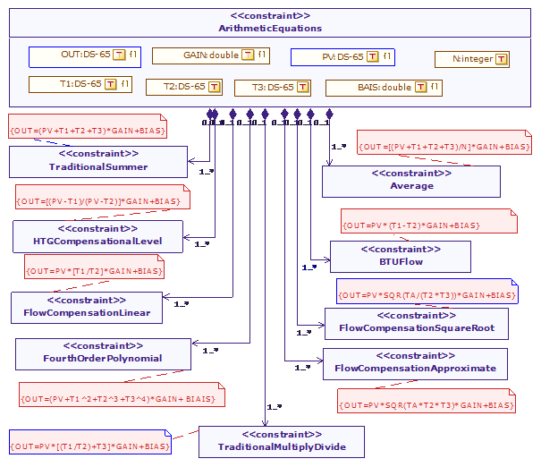
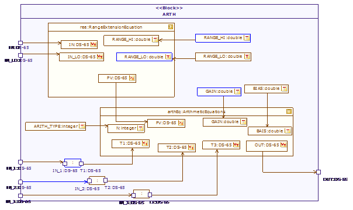

[[Modeling-the-arithmetic-functions-block]]

[[modeling-the-arithmetic-functions-block]]
= Modeling the arithmetic functions block

As seen in the previous figure, the pressure device block consists of several sub modules, among which we also find the ARTH (arithmetic functions) block. We will now describe the block diagram of this module using the SysML Block diagram. Here, using SysML constraint blocks, we will first define the relationships between the ARTH module and various other arithmetic equations that are used in this functional block, as shown in Figure 26.

[[Figure-26-Block-diagram-of-the-ARTH-functional-block-showing-the-relationship-with-different-arithmetic-equations]]

[[figure-26-block-diagram-of-the-arth-functional-block-showing-the-relationship-with-different-arithmetic-equations]]
Figure 26 Block diagram of the ARTH functional block showing the relationship with different arithmetic equations

In order to precisely determine how the ARTH module performs its operations, the SysML parametric diagram is used, as shown in Figure 27.

[[Figure-27-Parametric-diagram-of-ARTH-functional-block-providing-detailed-information-regarding-its-operation]]

[[figure-27-parametric-diagram-of-arth-functional-block-providing-detailed-information-regarding-its-operation]]
Figure 27 Parametric diagram of ARTH functional block providing detailed information regarding its operation

[[footer]]
