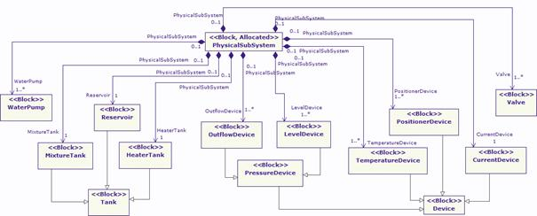
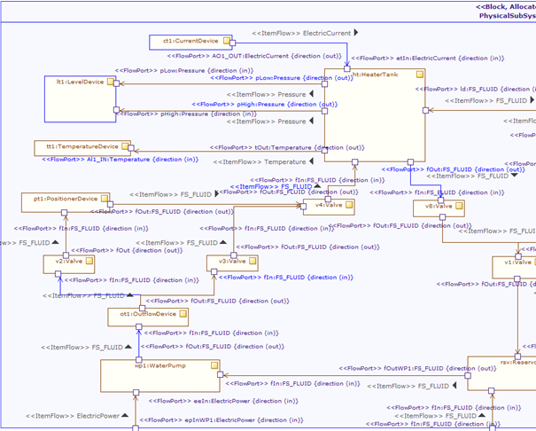
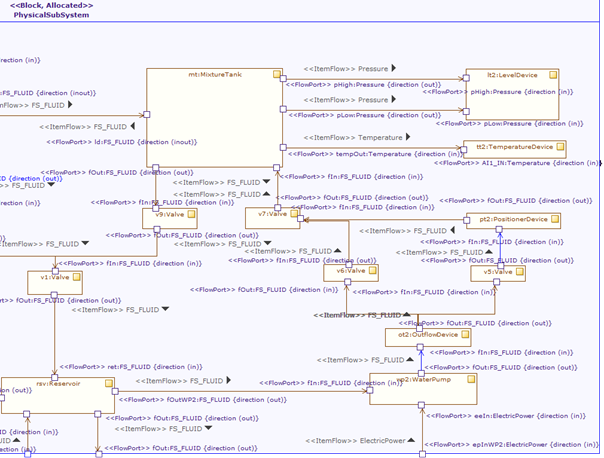

[[Modeling-the-physical-subsystem]]

[[modeling-the-physical-subsystem]]
= Modeling the physical subsystem

The physical subsystem represents the physical structure of the system in terms of the equipment installed within the system. Figure 21 represents the block diagram of the physical subsystem and determines its composition, consisting of modules such as valves, tanks and devices, among others.

[[Figure-21-Block-diagram-of-the-physical-subsystem]]

[[figure-21-block-diagram-of-the-physical-subsystem]]
Figure 21 Block diagram of the physical subsystem

While Figure 21 showed the relation of the physical subsystem with other modules, Figure 22 displays the internal composition of the physical subsystem by means of a SysML internal block diagram. Here, the structure of the subsystem is clearer compared to the previous figure. The ports of the sub modules of the physical subsystem are SysML flow ports, which indicate the flow of a specific entity. For example, ElectricPower represents an electric flow that passes between several modules of the physical subsystem. Similarly, other flow ports are typed with FS_FLUID, Pressure, etc., representing the flow of a fluid or pressure respectively.

[[Figure-22-Internal-Block-diagram-of-the-physical-subsystem-illustratinginternal-composition]]

[[figure-22-internal-block-diagram-of-the-physical-subsystem-illustratinginternal-composition]]
Figure 22 Internal Block diagram of the physical subsystem illustratinginternal composition

[[footer]]
