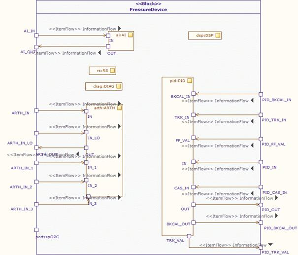

[[Modeling-the-pressure-device-block]]

[[modeling-the-pressure-device-block]]
= Modeling the pressure device block

Once the modeling of the three subsystems has been completed, the other parts of the automation unit can be modeled. Regarding this aspect, we will first model the pressure device block, as described earlier in Figure 21. The internal composition of this block is also illustrated by means of a SysML internal block diagram as shown in Figure 25. The internal composition consists of several sub modules or functional blocks such as AI (analog input functions), DSP (display functions) and ARTH (arithmetic functions), among others.

[[Figure-25-Internal-Block-diagram-of-the-pressure-device-illustrating-internal-composition]]

[[figure-25-internal-block-diagram-of-the-pressure-device-illustrating-internal-composition]]
Figure 25 Internal Block diagram of the pressure device illustrating internal composition

[[footer]]
