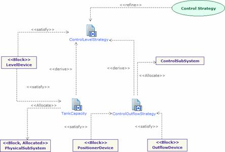

[[Modeling-the-system-requirements]]

[[modeling-the-system-requirements]]
= Modeling the system requirements

Figure 31 gives an overview of the requirements applied to the system. Here specifically, the requirements are related to the level control strategy. The different requirements are satisfied by some system blocks. The SysML allocation mechanism also enables system designers to map/allocate different elements, activities or other aspects.

[[Figure-31-Requirement-diagram-defining-the-level-control-strategy-as-initially-expressed]]

[[figure-31-requirement-diagram-defining-the-level-control-strategy-as-initially-expressed]]
Figure 31 Requirement diagram defining the level control strategy as initially expressed

[[footer]]
