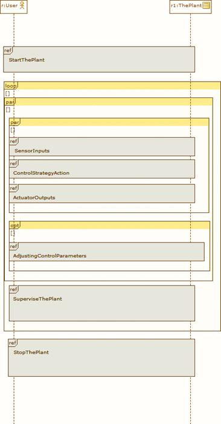

[[Modeling-the-sequence-diagram-for-Plant-operation]]

[[modeling-the-sequence-diagram-for-plant-operation]]
= Modeling the sequence diagram for Plant operation

Normally use case diagrams are detailed by related behavioral diagrams such as sequence diagrams. These enable control flow to be expressed, and we illustrate the sequence of operations/events related to the "Operate the Plant" use case scenario described in the previous figure. Sequence diagrams in turn can also be related to block diagrams, since they express interaction between the different elements present in the system. Here in the figure, we see several actions, such as the starting/stopping of the experimental plant unit in question and actions based on some control strategies, among others.

[[Figure-28-Sequence-diagram-representing-the-Plant-operation-case-scenario]]

[[figure-28-sequence-diagram-representing-the-plant-operation-case-scenario]]
Figure 28 Sequence diagram representing the Plant operation case scenario

[[footer]]
