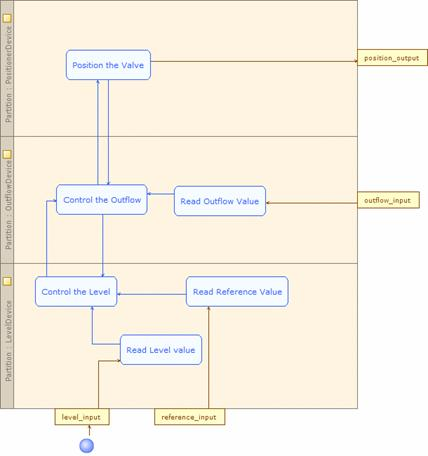

[[Modeling-the-control-strategy-action]]

[[modeling-the-control-strategy-action]]
= Modeling the control strategy action

We are now going to model the control strategy action. This action is expressed by means of a SysML activity diagram that focuses on the inputs, outputs, sequences and the related conditions. The control strategy is related to the global system and is among one of several strategies that the plant can implement.

[[Figure-30-Activity-diagram-defining-the-control-strategy-action-of-Figure-33]]

[[figure-30-activity-diagram-defining-the-control-strategy-action-of-figure-33]]
Figure 30 Activity diagram defining the control strategy action of Figure 33

[[footer]]
