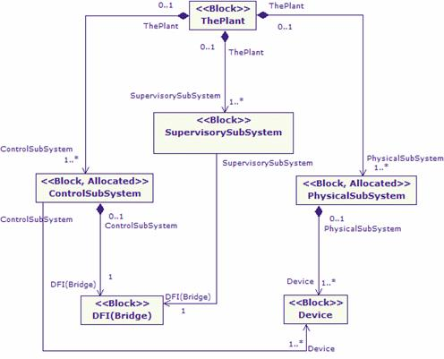

[[Modeling-the-system-structure]]

[[modeling-the-system-structure]]
= Modeling the system structure

Let us first look at the modeling of the global system structure as illustrated in Figure 19. This figure illustrates the composition of the system and the internal interactions, mainly by using a SysML block diagram. Here, the unit has been composed of three subsystems: the physical subsystem, the control subsystem and finally the supervisory subsystem. As shown in the figure, the control subsystem controls the physical subsystem by means of certain smart devices.

[[Figure-19-Global-system-structure-of-the-industrial-automation-unit]]

[[figure-19-global-system-structure-of-the-industrial-automation-unit]]
Figure 19 Global system structure of the industrial automation unit

[[footer]]
