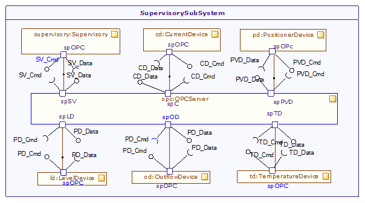

[[Modeling-the-supervisory-subsystem]]

[[modeling-the-supervisory-subsystem]]
= Modeling the supervisory subsystem

Let’s now look at the modeling of the supervisory subsystem. This subsystem is responsible for:

· the verification of the executing operations of the control strategy, implemented via the data acquisition from devices present in the field,

· the subsequent conveyance of this information to the user by means of a graphical display.

Once again, we will use the SysML internal block diagram to represent the internal composition of this subsystem. This diagram in turn represents a logical view of the system. Here it should be mentioned that the ports of the sub modules are not flow ports in nature, but are service ports, and have their required and provided interfaces respectively.

[[Figure-24-Internal-Block-diagram-of-the-supervisory-subsystem-illustrating-internal-composition]]

[[figure-24-internal-block-diagram-of-the-supervisory-subsystem-illustrating-internal-composition]]
Figure 24 Internal Block diagram of the supervisory subsystem illustrating internal composition

[[footer]]
