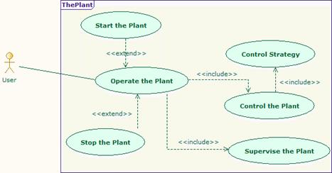

[[Modeling-the-use-case-diagram-related-to-system-behavior]]

[[modeling-the-use-case-diagram-related-to-system-behavior]]
= Modeling the use case diagram related to system behavior

Figure 20 gives an abstract overview of system behavior through a SysML use case diagram. The use case illustrates the system behavior visible to the end user external to the system. In the figure, there are several use cases present, related to how the system is operated, controlled, supervised etc. Here, plant refers to the experimental industrial automation unit.

[[Figure-20-Use-case-diagram-illustrating-global-system-behavior]]

[[figure-20-use-case-diagram-illustrating-global-system-behavior]]
Figure 20 Use case diagram illustrating global system behavior

[[footer]]
