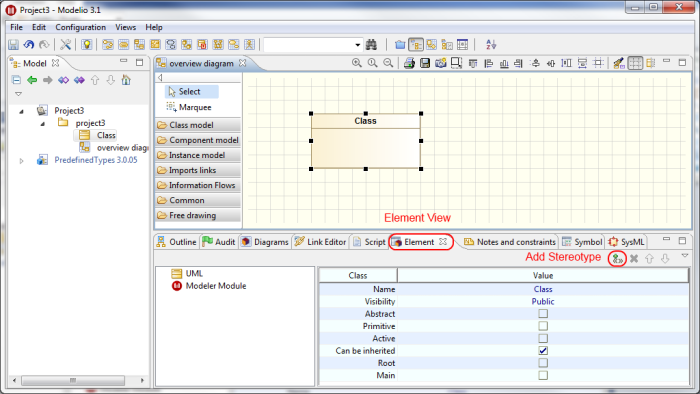
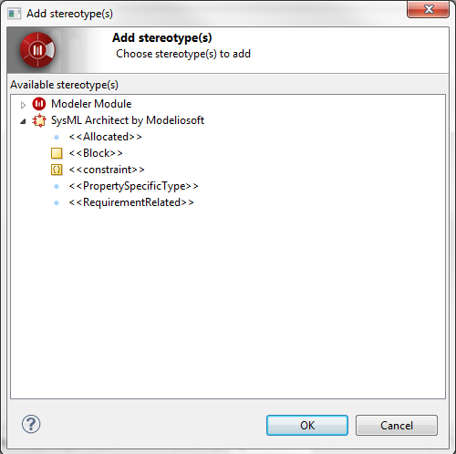

[[SysML-element-creation-in-expert-mode]]

[[sysml-element-creation-in-expert-mode]]
= SysML element creation in expert mode

The previous sections presented the Modelio approach to SysML modeling using dedicated diagrams. These diagrams enable the clear separation of concerns and concentrate on major use cases for SysML modeling. For the sake of clarity and user-friendliness, this is achieved by reducing the use of SysML.

The SysML module supports the entire collection of stereotypes defined in the specification. In order to benefit from this, users can work with Modelio in expert mode. In this mode, a user should create UML models and then annotate them with SysML stereotypes.

The following example gives instructions on the annotation of UML elements using SysML stereotypes.

Create any UML element. Go to the Element view and click on the adding stereotype button (Figure 17).

[[Figure-17-Adding-stereotype-command]]

[[figure-17-adding-stereotype-command]]
Figure 17 Adding stereotype command

Only applicable SysML stereotypes are shown in the dialogue window (Figure 18).

[[Figure-18-SysML-stereotypes-available-for-a-UML-class]]

[[figure-18-sysml-stereotypes-available-for-a-uml-class]]
Figure 18 SysML stereotypes available for a UML class

This mechanism is applicable for all stereotypes described in the SysML specification.

[[footer]]
