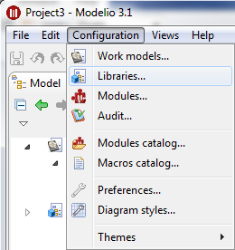
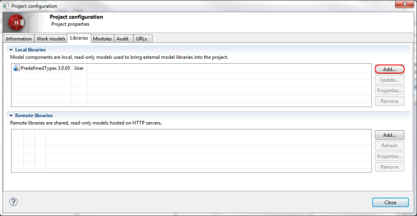
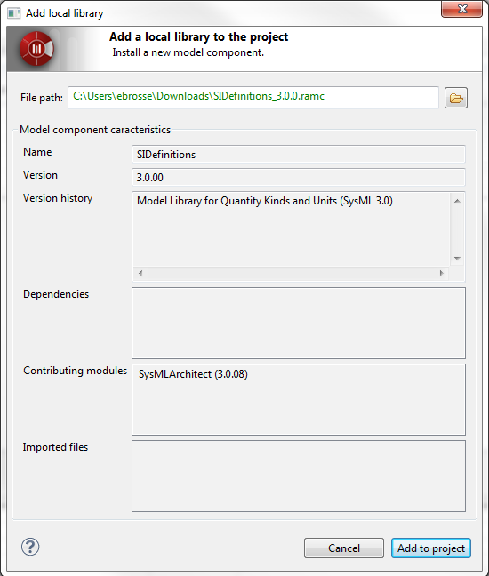
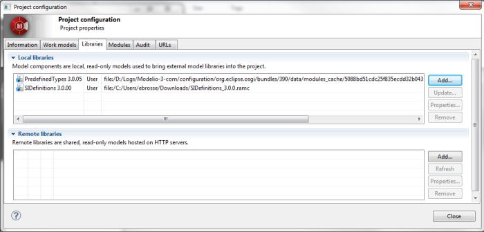
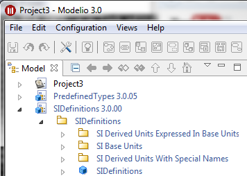

[[SysML-model-library]]

[[sysml-model-library]]
= SysML model library

The SysML specification defines a model library. This library contains a subset of the SysML quantities and units defined in order to represent the International System of Units. A model component has been packaged in order to model this library. For deploying this model component, go to the Configuration menu, then Deploy a model Component… as shown in Figure 1.

[[Figure-1-Model-component-deployment-command]]

[[figure-1-model-component-deployment-command]]
Figure 1 Model component deployment command

In the project configuration windows depicted in Figure 2 clicks on the Add… button.

[[Figure-2-Project-configuration-window]]

[[figure-2-project-configuration-window]]
Figure 2 Project configuration window

The window depicted in Figure 3 should appear. In the File path field select the SIDefinitions.ramc file http://forge.modelio.org/projects/sysml-modelio3/files[available here], and click Deploy.

[[Figure-3-Model-component-deployment-window]]

[[figure-3-model-component-deployment-window]]
Figure 3 Model component deployment window

The Figure 4 and 5 represent the result of the SIDefinition model component deployment.

[[Figure-4-Model-component-deployment-window]]

[[figure-4-model-component-deployment-window]]
Figure 4 Model component deployment window

[[Figure-5-Model-component-deployed]]

[[figure-5-model-component-deployed]]
Figure 5 Model component deployed

[[footer]]
