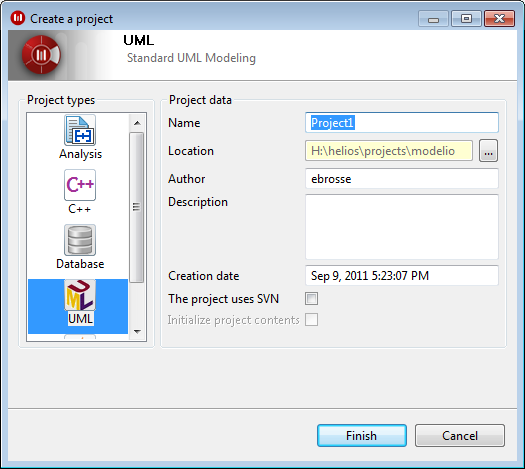
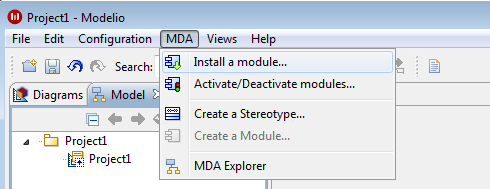
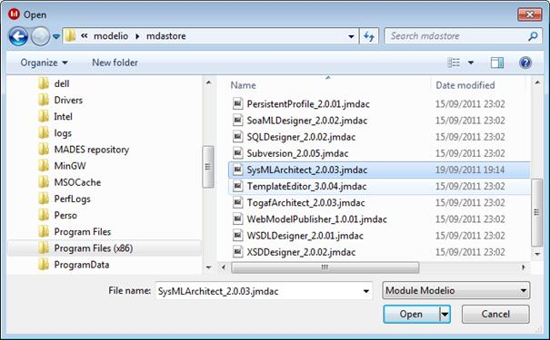

[[SysML-Architect-installation]]

[[sysml-architect-installation]]
= SysML Architect installation

After installing Modelio, start the modeler and create a simple UML model.

[[Figure-1-Creating-a-default-UML-model-with-Modelio]]

[[figure-1-creating-a-default-uml-model-with-modelio]]
Figure 1 Creating a default UML model with Modelio

Go to the MDA menu and choose _Install a module…_ as shown in Figure 2.

[[Figure-2-Module-deployment]]

[[figure-2-module-deployment]]
Figure 2 Module deployment

You will now be in the _mdastore_ folder. Proceed to the location of the SysML Architect module (see Figure 3).

[[Figure-3-The-ldquomdastorerdquo-module-folder]]

[[figure-3-the-mdastore-module-folder]]
Figure 3 The "mdastore" module folder

Choose _SysMLArchitect_x.yy.zz.jmdac_ and click on the _Open_ button.

_SysMLArchitect_x.yy.zz.jmdac_ contains SysML UML2 Profile. It is compatible with Modelio.

[[footer]]
