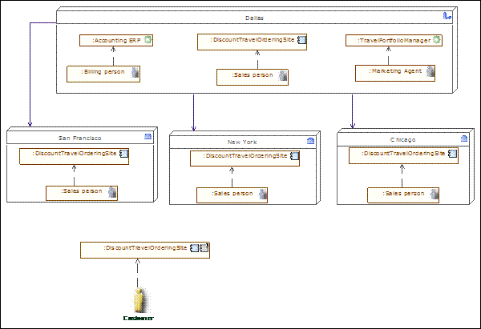

[[Application-modeling]]

[[application-modeling]]
= Application modeling

*Application Architecture* provides a blueprint for the deployment of individual application systems, their interactions, and their relationships to the core business processes of the organization.

[[Opportunity-and-solution-modeling]]

[[opportunity-and-solution-modeling]]
=== Opportunity and solution modeling

[[Project-context-diagrams]]

[[project-context-diagrams]]
===== Project context diagrams

A project context diagram shows the scope of a work package to be implemented as a part of a broader transformation roadmap. The project context diagram links a work package to the organizations, functions, services, processes, applications, data and technology that will be added, removed or impacted by the project. The project context diagram is also a valuable tool for project portfolio management and project mobilization.

*Note :* Drag & drop the essential application component of the project, the main requirements and the related business processes, business interfaces and business functions, and express which requirements are satisfied by the project, which business processes are implemented, which functions are related, and which roles will use the targeted components. Relationships to other parts of the IS can also be expressed.

 +
*In this diagram, the context is centered on the "DiscountTravelOrderingSite"*

[cols=",",options="header",]
|==============================================================================================================================
|Togaf elements |description
| |*External actor:* An actor that is external to the enterprise.
|==============================================================================================================================

image:images/Modeling_Application_modeling_image026.gif[image] | *Internal actor:* An actor that belongs to the enterprise.  | *Requirements:* In this context, these are business requirements.  | *Interaction application component:* Represents the top level components that manage the interaction with elements outside the IS. In most cases, it is a GUI component, such as here a web interface.  | *Function:* Describes one function of the organization. image:images/Modeling_Application_modeling_image057.gif[image] | *Database application component:* Represents a repository. In pure SOA architecture, these elements should not appear. However, for legacy analysis or technology architecture, modeling repositories or repository deployment can be useful.  | *Application:* This application component corresponds to legacy applications, off the shelf products, or can be an assembly of application components.  | *System federation:* A system federation is the coarser-grained application component. It assembles systems to federate them, such as in the example of cooperation between different information systems between different companies.  | *Use case:* Represents an interaction between an actor and the system, in order to fulfill a business need. A use case is further described by a set of scenarios that express the interactions between the system and the actors.  | *Business service:* Represents a service provided by the business, which may then be realized by one or more IS services.  | *Business process:* As presented in process maps (event diagrams). The business process is detailed in flow diagrams.  | *Consumes <<* Expresses that a participant (e.g. an actor) consumes an element of the IS (service, operation, application component). image:images/Modeling_Application_modeling_image062.gif#,image>> | *Information flow:* Defines the flow of any kind of information (business entity, event, product, informal, etc) between active entities of the enterprise. image:images/Modeling_Application_modeling_image061.gif[image] | *Consumes <<* Expresses that a participant (e.g. an actor) consumes an element of the IS (service, operation, application component). image:images/Modeling_Application_modeling_image063.gif#,image>> | *Realizes <<* Component realization. An application component realizes the designated element, for example a business process. image:images/Modeling_Application_modeling_image064.gif#,image>> | *Satisfy link:* Expresses that an element of the IS satisfies a requirement.

[[Architecture-vision-modeling]]

[[architecture-vision-modeling]]
=== Architecture vision modeling

[[Solution-concept-diagrams]]

[[solution-concept-diagrams]]
===== Solution concept diagrams

A solution concept diagram provides a high-level orientation of the solution that is envisaged in order to meet the objectives of the architecture engagement. In contrast to the more formal and detailed architecture diagrams developed in the following phases, the solution concept represents a pencil

sketch of the expected solution at the outset of the engagement. This diagram may embody key objectives, requirements and constraints for the engagement, and also highlight work areas to be investigated in more detail with formal architecture modeling. The purpose of this diagram is to quickly on-board and align stakeholders for a particular change initiative, so that all participants understand what the architecture engagement is seeking to achieve and how it is expected that a particular solution approach will meet the needs of the enterprise.

Present only the main application components of the solution, and summarize their connections using "access" dependencies. Connect them to existing applications when necessary. Connect them to requirements, processes or functions, themselves connected to goals. Also express (via "consumes" dependencies) which role uses which component.

A "macro" vision of the architecture of the targeted solution is therefore presented, including links to the goals and requirements that the different elements of the solution must satisfy.

*Note :* Create and drag & drop the components. Drag & drop the relevant requirements, goals, processes, functions or business services. Unmask or create the appropriate dependencies (consumes, satisfy, assigned, …).

[cols=",",options="header",]
|=============================================================================================================================================================================================================================================================================================================
|Togaf elements |description
| |*Requirements:* In this context, these are business requirements.
|image:images/Modeling_Application_modeling_image051.gif[image] |*Goal:* A goal or objective of the enterprise.
| |*External actor:* An actor that is external to the enterprise.
|image:images/Modeling_Application_modeling_image026.gif[image] |*Internal actor:* An actor that belongs to the enterprise.
|image:images/Modeling_Application_modeling_image057.gif[image] |*Database application component:* Represents a repository. In pure SOA architecture, these elements should not appear. However, for legacy analysis or technology architecture, modeling repositories or repository deployment can be useful.
|image:images/Modeling_Application_modeling_image011.gif[image] |*Entity application component:* An entity component is frequently derived from business entities, and is responsible for managing the access to the entity, and its integrity.
|image:images/Modeling_Application_modeling_image011.gif[image] |*Entity application component:* An entity component is frequently derived from business entities, and is responsible for managing the access to the entity, and its integrity.
|image:images/Modeling_Application_modeling_image014.gif[image] |*Utility component:* Represents an application component that is frequently reused, and most of the cases bought off the shelf.
| |*System federation:* A system federation is the coarser-grained application component. It assembles systems to federate them, such as in the example of cooperation between different information systems between different companies.
| |*Process application component:* A process application component is responsible for a business process execution. It orchestrates the tasks of the process.
|image:images/Modeling_Application_modeling_image012.gif[image] |*Interaction application component:* Represents the top level components that manage the interaction with what is outside of the IS. In most cases, it is a GUI component, such as here a web interface.
| |*Application:* This application component corresponds to legacy applications, off the shelf products, or can be an assembly of application components.
| |*Business process:* As presented in process maps (event diagrams). The business process is detailed in flow diagrams.
| |*Component realization:* An application component realizes the designated element, for example a business process.
| |*Assigned link:* Assignment of a goal to an element of the enterprise, typically an actor, an organization unit or a business process.
| |*Consumes link:* Expresses that a participant (e.g. an actor) consumes an element of the IS (service, operation, application component).
| |*Satisfy link:* Expresses that an element of the IS satisfies a requirement.
|=============================================================================================================================================================================================================================================================================================================

[[Value-chain-diagrams]]

[[value-chain-diagrams]]
===== Value chain diagrams

A value chain diagram provides a high-level orientation view of an enterprise and how it interacts with the outside world. In contrast to the more formal functional decomposition diagram developed within Phase B (Business Architecture), the value chain diagram focuses on presentational impact. The purpose of this diagram is to quickly on-board and align stakeholders for a particular change initiative, so that all participants understand the high- level functional and organizational context of the architecture engagement. A usual practice consists in showing a simplified business process diagram, and for each task defining its value factors and changes needed.

*Note :* Use sequence dependencies between functions to express value chains. The "Value factors" and "Changes needed" types of notes express this key information.

image:images/Modeling_Application_modeling_image068.png[image] +
*Value chain of the DiscountTravel company*

[cols=",",options="header",]
|=========================================================================================================================
|Togaf elements |description
| |*Function:* Describes one function of the organization
| |*Sequence link:* Represents a sequence between functions.
|=========================================================================================================================

[[243-Data-architecture-at-application-level]]

[[data-architecture-at-application-level]]
=== 2.4.3 Data architecture at application level

[[244-Application-architecture-modeling]]

[[application-architecture-modeling]]
=== 2.4.4 Application architecture modeling

Application and user location diagrams

The application and user location diagram shows the geographical distribution of applications. It can be used to show where applications are used by the end users; the distribution of where the host application is executed and/or delivered in client scenarios; the distribution of where applications are developed, tested, and released, and so on. Analysis can reveal opportunities for rationalization, as well as duplication and/or gaps. The purpose of this diagram is to clearly depict the business locations from which business users typically interact with applications, but also the hosting location of the application infrastructure.

The diagram enables:

* Identification of the number of package instances needed to sufficiently support the user population, which may be spread out geographically.
* Estimation of the number and type of user licenses for the package or other software.
* Estimation of the level of support needed for the users and location of support center.
* Selection of the system management tools, structure and management system required to support enterprise users/customers/partners, both locally and remotely.
* Appropriate planning for the technological components of the business, namely server sizing and network bandwidth, and so on.
* Performance considerations when implementing application and technology architecture solutions.

Users typically interact with applications in a variety of ways, for example: * To support the operations of the day-to-day business. * To participate in the execution of a business process. * To access information (look-up, read). * To develop the application. * To administer and maintain the application.

*Note :* Drag & drop the locations of the enterprise, then drag and drop the material (typically the servers) into these locations, and then drag & drop the application components or software elements into the material. Users (roles or actors) can also be deployed in different locations

by dragging and dropping them. Typically, this diagram represents where each server is located, and on which server which application is executed.

 +
*This diagram shows who is using which application on which site*

[cols=",",options="header",]
|===============================================================================================================================================================================================================================================================================
|Togaf elements |description
| |*Headquarter location:* Geographically defines where the elements of the enterprise are deployed (organization units, hardware devices, actors, etc.)
| |*Site location:* Geographically defines where the elements of the enterprise are deployed (organization units, hardware devices, actors, etc.). Generally, an enterprise has one headquarter and several sites.
| |*Application:* This application component corresponds to legacy applications, off the shelf products, or can be an assembly of application components.
|image:images/Modeling_Application_modeling_image012.gif[image] |*Interaction application component:* Represents the top level components that manage the interaction with elements outside the IS. In most cases, it is a GUI component, such as here a web interface.
| |*External Actor:* An actor that is external to the enterprise.
|image:images/Modeling_Application_modeling_image026.gif[image] |*Internal actor:* An actor that belongs to the enterprise.
|image:images/Modeling_Application_modeling_image009.gif[image] |*Association between two classes:* An association has a name, and for each extremity provides the role name and cardinalities (possible number of occurrences) of related elements.
|===============================================================================================================================================================================================================================================================================

[[Application-communication-diagrams]]

[[application-communication-diagrams]]
===== Application communication diagrams

The purpose of the application communication diagram is to depict all models

and mappings related to communication between applications in the metamodel entity. It shows application components and interfaces between components. Interfaces may be associated with data entities where appropriate.

Applications may be associated with business services where appropriate. Communication should be logical and should only show intermediary technology

where it is architecturally relevant.

Application communication diagrams present either an application map of what already exists, or a logical architecture of the future situation. SOA-type architecture is encouraged. This type of architecture is based on service- oriented application components. Where the architecture is hybrid, a mix of (non-SOA) applications, repositories and new SOA-architectured parts can be shown.

In an SOA-oriented architecture, it is recommended that service application components be structured according to their nature and their level: components dedicated to interactions (GUI, WEB), components dedicated to process executions, and entity components which are the most stable.

Components are interconnected via their required and provided services, which are linked by connectors. These required and provided services are typed by IS services which are modeled elsewhere. The service operations provided by these services transport data (parameters) whose types are also modeled in the form of "messages".

*Note :* Use application components to present an SOA- oriented architecture as much as possible. Different kinds of application components exist that allow them to be structured into layers. The main kind of application components are GUI (interaction), process and entity. An application architecture may be hybrid due to the legacy system or external applications. "Application" or "DataBase" components serve this purpose, and can be mixed with SOA-oriented service components. Application components are connected via required or provided services which are connected via

connectors. Provided/required services are typed by IS services that are generally modeled elsewhere.

 +
*The architecture is layered: the interaction component (site) is on top, process components in the middle, and entity components on the bottom*

[cols=",",options="header",]
|=============================================================================================================================================================================================================================================================================================================
|Togaf elements |description
|image:images/Modeling_Application_modeling_image012.gif[image] |*Interaction application component:* Represents the top level components that manage the interaction with elements outside the IS. In most cases, this is a GUI component, such as here a web interface.
|image:images/Modeling_Application_modeling_image011.gif[image] |*Entity application component:* An entity component is frequently derived from business entities, and is responsible for managing the access to the entity, and its integrity.
| |*Process application component:* A process application component is responsible for a business process execution. It orchestrates the tasks of the process.
| |*System federation:* A system federation is the coarser-grained application component. It assembles systems to federate them, such as in the example of cooperation between different information systems between different companies.
|image:images/Modeling_Application_modeling_image014.gif[image] |*Utility component:* Represents an application component that is frequently reused, and most of the cases bought off the shelf.
|image:images/Modeling_Application_modeling_image057.gif[image] |*Database application component:* Represents a repository. In pure SOA architecture, these elements should not appear. However, for legacy analysis or technology architecture, modeling repositories or repository deployment can be useful.
| |*Application:* This application component corresponds to legacy applications, off the shelf products, or can be an assembly of application components.
| |b>Provided services:** Access points to application components through provided services.
| |*Required services:* Required services of application components need to be connected to provided services by other components.
| |*Connector:* Used between provided or required services, and or instances of application components.
| |*Information flow:* Defines the flow of any kind of information (business entity, event, product, informal, etc.) between active entities of the enterprise.
| |*Flow link:* Flow link between data (e.g. business entity, event, product) and active elements (e.g. business process, service).
| |*External actor:* An actor that is external to the enterprise
| |*Comsumes link:* Expresses that a participant (e.g. actor) consumes an element of the IS (service, operation, application component).
|=============================================================================================================================================================================================================================================================================================================

[[Application-migration-diagrams]]

[[application-migration-diagrams]]
===== Application migration diagrams

The application migration diagram identifies application migration from baseline to target application components. It enables a more accurate

estimation of migration costs by showing precisely which applications and

interfaces need to be mapped between migration stages.

In Modelio, one strategy is to model the overall information system as a

system application component for each of its states. In the context of each version of the system, instances of application components will be created (by simply dragging & dropping application components into the system component). This enables you to show several instances of identical components deployed in several versions of the IS. Between these instances, "migration" dependencies are drawn. The model can be more accurate, and focused, for example, on different versions of services on different occurrences of application components.

The aim is to define the trajectory between the current version of the IS and the version that you wish to obtain, over several stages. The component deployment technique enables you to present the same component deployed in several versions of the IS, and interconnected differently according to the context.

 +
*Migration strategy in three steps*

In this diagram, we see that the "Travel" application component will be developed in three versions. The first one will still be based on the TravelPortfolioManagement (legacy) application, whilst the second version will work on its own, with direct access to the repository.

Each version of the IS is represented by a different "system element" in which occurrences of application components are deployed. This allows you to show that the same application component is used in several versions, or that an application component in version N will migrate into one or several application components in version N+1.

[cols=",",options="header",]
|==============================================================================================================================================================================================================================================
|Togaf elements |description
| |*System:* In general, all application components are directly or recursively embedded within the system. This frequently represents the IS of the enterprise.
| |*Application:* This application component corresponds to legacy applications, off the shelf products, or can be an assembly of application components.
|image:images/Modeling_Application_modeling_image011.gif[image] |*Entity application component:* An entity component is frequently derived from business entities, and is responsible for managing the access to the entity, and its integrity.
| |*Process application component:* A process application component is responsible for a business process execution. It orchestrates the tasks of the process.
| |*Migrates link:* Migration of elements between two versions of the IS. This is generally used between business entities, or application components.
|==============================================================================================================================================================================================================================================

[[Enterprise-manageability-diagrams]]

[[enterprise-manageability-diagrams]]
===== Enterprise manageability diagrams

The enterprise manageability diagram shows how one or more applications interact with application and technology components that support operational management of a solution. This diagram is really a filter on the application communication diagram, specifically for enterprise management class software.

Analysis can reveal duplication and gaps, and opportunities in the IT service management operation of an organization. It would identify temporary applications, staging areas, and the infrastructure required to support migrations (for example, parallel run environments, etc).

*Note :* The use of enterprise manageability diagrams is similar to that of application communication diagrams, where some application components and their properties are dragged and dropped from the explorer. The "migrates" dependency is frequently used there.

 +
*Manageability diagram focused on the "Travel" application component migration issue*

In this example, an enterprise manageability diagram shows how a part of the system will evolve to progressively pass from a hybrid situation (where "Travel" component (V1) uses the earlier "TravelPortfolioManager" application which manages data access), to a situation without this earlier application, where the "Travel" component (V2) uses the new central repository. The use of "migrate" links summarizes which old parts are replaced by which new parts.

[cols=",",options="header",]
|======================================================================================================================================================================================================================================================================
|Togaf elements |description
|image:images/Modeling_Application_modeling_image011.gif[image] |*Entity application component:* An entity component is frequently derived from business entities, and is responsible for managing the access to the entity, and its integrity.
|image:images/Modeling_Application_modeling_image012.gif[image] |*Interaction application component:* Represents the top level components that manage the interaction with elements outside the IS. In most cases, it is a GUI component, such as here a web interface.
|======================================================================================================================================================================================================================================================================

 | *Provided services:* Access points to application components through provided services.  | *Required services:* Required services of application components need to be connected to provided services by other components.  | *Application:* This application component corresponds to legacy applications, off the shelf products, or can be an assembly of application components. image:images/Modeling_Application_modeling_image057.gif[image] | *Database application component:* Represents a repository. In pure SOA architecture, these elements should not appear. However, for legacy analysis or technology architecture, modeling repositories or repository deployment can be useful.  | *Migrates <<* Migration of elements between two versions of the IS. Generally used between business entities, or application components. image:images/Modeling_Application_modeling_image077.gif#,image>> | *Information flow:* Defines the flow of any kind of information (business entity, event, product, informal, etc.) between active entities of the enterprise. image:images/Modeling_Application_modeling_image076.gif[image] | *Connector:* Used between provided or required services, and or instances of application components.

[[ProcessSystem-realization-diagrams]]

[[processsystem-realization-diagrams]]
===== Process/System realization diagrams

The purpose of the process/system realization diagram is to clearly depict the sequence of events when multiple applications are involved in the execution of

a business process. It enhances the application communication diagram by augmenting it with any sequencing constraints, and hand-off points between

batch and real-time processing. It identifies complex sequences that could be

simplified, as well as possible rationalization points in the architecture in order to provide more timely information to business users. It can also identify process efficiency improvements that may reduce interaction traffic between applications.

*Note :* Drag & drop the processes that you want to illustrate, drag & drop the application components that are involved, and draw "component realization" dependencies. Indications of role or order can be made using information flows (as in the example), or notes attached to elements.

 +
*Two processes are realized by one application, and two application components*

[cols=",",options="header",]
|======================================================================================================================================================================================================================================================================
|Togaf elements |description
| |*Interaction application component*: Represents the top level components that manage the interaction with elements outside the IS. In most cases, it is a GUI component, such as here a web interface.
| |*Process application component*: A process application component is responsible for a business process execution. It orchestrates the tasks of the process.
|image:images/Modeling_Application_modeling_image086.gif[image] |*Business process*: As presented in process maps (event diagrams). The business process is detailed in flow diagrams.
| |*Application*: This application component corresponds to legacy applications, off the shelf products, or can be an assembly of application components.
| |*Component realization*: An application component realizes the designated element, for example a business process.
|======================================================================================================================================================================================================================================================================

 | *Access link*: Dependency between parts of the IS, such as typically application components. Expresses that the origin element uses or accesses to elements of the destination.  | *Information flow*: Defines the flow of any kind of information (business entity, event, product, informal, etc) between active entities of the enterprise.

[[System-use-case-diagrams]]

[[system-use-case-diagrams]]
===== System use case diagrams

A system use case diagram displays the relationships between consumers and providers of application services. Application services are consumed by actors or other application services and the application use case diagram provides added richness in describing application functionality by illustrating how and when that functionality is used. The purpose of the system use case diagram is to help to describe and validate the interaction between actors and their roles with applications. As the architecture progresses, the use case can evolve from functional information to include technical realization details. Architectural system use cases can also be re-used in more detailed system design work.

System use case diagrams use UML use cases. TOGAF roles and actors are used in place of UML actors. "Component realization" links enable you to express which application components implement which use cases.

*Note :* Create use cases, drag and drop roles and actors, drag and drop application components, and draw communication links between roles and use cases, and component realization links between components and use cases.

 +
*Use cases are enriched by the presentation of the application components that implement them*

[cols=",",options="header",]
|==================================================================================================================================================================================================================================================================================================
|Togaf elements |description
| |*External actor:* An actor that is external to the enterprise
|image:images/Modeling_Application_modeling_image026.gif[image] |*Internal actor:* An actor that belongs to the enterprise.
|image:images/Modeling_Application_modeling_image092.png[image] |*Use case:* Represents an interaction between an actor and the system, in order to fulfill a business need. A use case is further described by a set of scenarios that express the interactions between the system and the actors.
| |*Communication link:* Expresses the communication that takes place between actors and the use case in which they are involved.
| |*Component realization link:* Component realization between an application component and the business element that it implements.
|==================================================================================================================================================================================================================================================================================================

[[footer]]
