[[Business-modeling]]

[[business-modeling]]
= Business modeling

*Business Architecture* defines business strategy, governance, organization, and key business processes.

*Data Architecture* describes the structure of an organization’s logical and physical data assets and data management resources.

[[Data-architecture-modeling]]

[[data-architecture-modeling]]
=== Data architecture modeling

[[Class-diagrams]]

[[class-diagrams]]
===== Class diagrams

The key purpose of the class diagram is to depict the relationships among the critical data entities (or classes) within the enterprise. This diagram is developed to clearly present these relationships and to help understand the lower-level data models for the enterprise. This is a class diagram, where the main notion is the "Business Entity".

The TOGAF class diagram as defined is situated at an early, conceptual stage. The highest level allows the essential business notions of enterprise to be represented, without being distracted by organizational or historical complexities specific to each organization. This conceptual level enables you to think about the business, in order to define an ideal organization with regard to this particular business. These entities will be used to define business processes (products handled by processes), and will be derived to define service application components, exchange data between services and repository data schemas.

*Note :* This diagram is at a high level of representation (conceptual). We are interested here in modeling the main business entities, their properties and relationships. The persistency model (_typically_ for RDB) will be inferred later at the application layer.

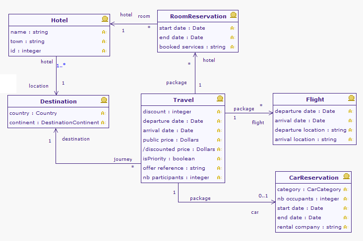

[cols=",",options="header",]
|======================================================================================================================================================================================================================================================
|Togaf elements |description
| |*Business entity*: Describes the semantics of the entities in the business, independently of any IS consideration (e.g. storage, technology, etc).
|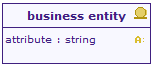 |*Business entity* (developed form): This also presents here one attribute, in other words, one property that the entity may have.
| |*Association between two classes*: An association has a name, and for each extremity provides the role name and cardinalities (possible number of occurrences) of related elements.
|======================================================================================================================================================================================================================================================

[[Data-dissemination-diagrams]]

[[data-dissemination-diagrams]]
===== Data dissemination diagrams

The purpose of the data dissemination diagram is to show the relationship between data entities, business services, and application components. The diagram shows how the logical entities are to be physically realized by application components. This allows effective sizing to be carried out and the

IT footprint to be refined. Moreover, by assigning business value to data, an indication of the business criticality of application components can be gained. Additionally, the diagram may show data replication and system ownership of the master reference for data. In this instance, it can show two copies and the master-copy relationship between them. This diagram can include services; in other words, services that encapsulate data and reside in an application, or services that reside in an application and access data encapsulated within the application.

*Note:* Data dissemination diagrams are a kind of architecture diagram, where data entities are connected to application components. First, drag & drop application components from the application architecture, and then drag and drop business entities, either within the application components to show their localization, or beside them, with dependency links.

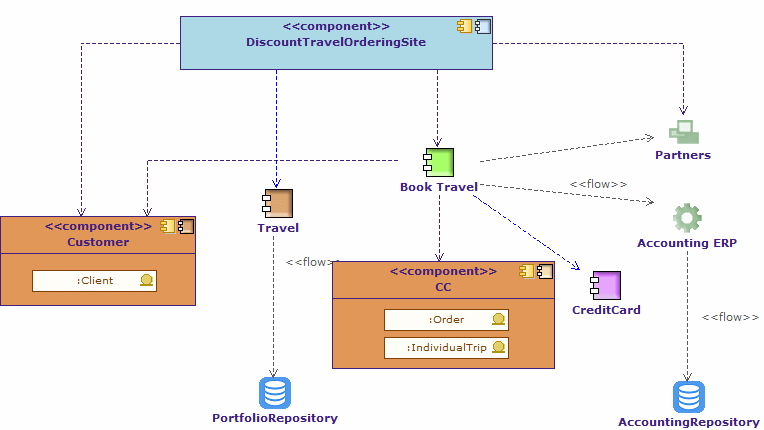

[cols=",",options="header",]
|================================================================================================================================================================================================================================================================================================================================
|Togaf elements |description
| |*Entity application component:* An entity component is frequently derived from business entities, and is responsible for managing the access to the entity, and its integrity.
| |*Interaction application component:* Represents the top level components that manage the interaction with elements outside the IS. In most cases, it is a GUI component, such as here a web interface.
| |*Process application component:* A process application component is responsible for a business process execution. It orchestrates the tasks of the process.
| |*Utility component*: Represents an application component that is frequently reused, and most of the cases bought off the shelf.
| |*Database application component:* Represents a repository. In pure SOA architecture, these elements should not appear. However, for legacy analysis or technology architecture, modeling repositories or repository deployment can be useful.
|image:images/Modeling_Business_modeling_SystemFederation32.png[image] |*System federation:* A system federation is the coarser-grained application component. It assembles systems to federate them, such as in the example of cooperation between different information systems between different companies.
| |*Application:* This application component corresponds to legacy applications, off the shelf products, or can be an assembly of application components.
| |*Business entity:* Describes the semantics of the entities in the business, independently of any IS consideration (e.g. storage, technology, etc).
| |*Date flow:* Expresses that data (for example business entity) is input or output from a dynamic entity.
|================================================================================================================================================================================================================================================================================================================================

[[Data-lifecyle-diagrams]]

[[data-lifecyle-diagrams]]
===== Data lifecyle diagrams

The data lifecycle diagram is an essential part of managing business data throughout its lifecycle, from conception through disposal, within the constraints of the business process. The data is considered as an entity in its own right, detached from business processes and activities. Each change in state is represented in the diagram, which may include the event or rules that trigger that change in state. The separation of data from process allows common data requirements to be identified, thereby enabling more effective resource sharing to be achieved.

Defining the lifecycle of business entities enables better formalization of these business entities, as well as the determination of the steps that are essential to their management. This very simple state model will be a guide in the definition of business processes, since these processes will themselves have to respect the constraints defined for transitions between states: if a business entity has not passed through all its states within the business processes that handle it, then these are incomplete. If the business processes transgress the lifecyle of the business entities, then they are incorrect.

*Note:* Identify the possible states of the entity (for example, a document can be "underConstruction", "underRevision", "approved", and so on), and then define the possible transitions between each states. A state must be a stable data situation: when no action is executed on it, the data is always in one of the identified states.

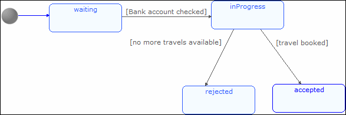 +
*Lifecycle of the "Order" business entity*

[cols=",",options="header",]
|====================================================================================================================================================================
|Togaf elements |description
| |*tate:* Represents one of the main stable situations of a business entity or a product.
| |*Transition:* Represents the move from one state to another state due to an action on the owner entity.
|====================================================================================================================================================================

[[Data-migration-diagrams]]

[[data-migration-diagrams]]
===== Data migration diagrams

The purpose of the data migration diagram is to show the flow of data from the source to the target applications. The diagram will provide a visual representation of the spread of sources/targets and serve as a tool for data auditing and establishing traceability. This diagram can be elaborated or enhanced and detailed as necessary. For example, the diagram can contain just an overall layout of migration landscape or can go into detail at individual application metadata element level.

Use the previous data model (which should be in a separate information domain), drag and drop previous and new entities, and use the "migrates" dependency to express how previous data is translated into new entities.

*Note :* Data migration can be expressed at conceptual, logical or physical level. Application communication diagrams can also be used to express data migration. The "migrate" dependency is the key element to formalize migration.

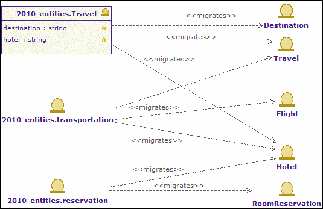 +
*Migrate dependencies can be between business entities, or be more accurately defined at the "attribute" level*

In this example, we see that several attributes from the previous data model have been promoted to "entities" in the new data model.These diagrams can quickly become cluttered by links, when they should be focused on the origin or destination business entities. An alternative is to use tables, as shown below:

Origin

migrates in

Element

Nature

Element

Nature

transportation

Class

Travel

Class

Hotel

Class

Flight

Class

Travel

Class

Travel

Class

Travel.destination

Attribute

Destination

Class

Travel.hotel

Attribute

Hotel

Class

Reservation

Class

Roomreservation

Class

Hotel

Class

We see that the new model is better structured, as it groups previously scattered information. It is normalized.

[cols=",",options="header",]
|========================================================================================================================================================================================================================
|Togaf elements |description
| |*Business entity:* Describes the semantics of the entities in the business, independently of any IS consideration (e.g. storage, technology, etc).
| |*Business entity (developed form):* This also presents here one attribute, in other words, one property that the entity may have.
| |*Migrates link:* Migration of elements between two versions of the IS. Generally used between business entities or application components.
|========================================================================================================================================================================================================================

[[Data-security-diagrams]]

[[data-security-diagrams]]
===== Data security diagrams

Data is considered as an asset to the enterprise and data security simply means ensuring that enterprise data is not compromised and that access to it is suitably controlled. The purpose of the data security diagram is to depict which actor (person, organization, or system) can access which enterprise data. This relationship can be shown in matrix form between two objects, or can be shown as a mapping. The diagram can also be used to demonstrate compliance with data privacy laws and other applicable regulations (HIPAA, SOX, etc). This diagram should also consider any trust implications where an enterprise’s partners or other parties may have access to the company’s systems, such as an outsourced situation where information may be managed by other people and may even be hosted in a different country.

Alternatively, tables can be created, as in the example below:

[cols=",,,,,",options="header",]
|==============================================
| |Client |Individual trip |Order |Travel |Bill
|Sales person |CRUD |CRUD |CRUD |CRUD |CRUD
|Marketing Agent | | | |CRUD |
|Billing Person | | | | |CRUD
|Customer |CRUD |CRUD |CRUD |CRUD |CRUD
|==============================================

However, the links need to be created, since they can be used in any kind of diagram.

Drag and drop the data (business entities, data entities) you want to show, drag and drop roles or actors involved with these entities and express the access mode of each participant to each entity using and evaluating "flow" dependencies.

*Note :* Large diagrams can become hard to read. We recommend that one data security diagram be created per business entity and/or per participant (typically an actor). In particular, diagrams focused on actors and their missions can provide habilitation links. Diagrams may also focus on external access to the system, that is on which data the external actors can access.

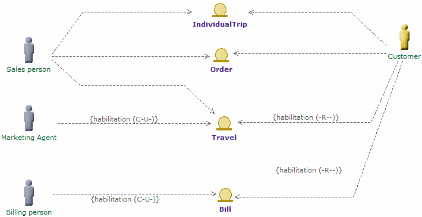 +
*This diagram expresses who has the right to access which data and with which rights*

[cols=",",options="header",]
|=================================================================================================================================================================================================================================================================================================================================
|Togaf elements |description
| |*External actor:* An actor that is external to the enterprise.
| |*Internal actor:* An actor that belongs to the enterprise.
| |*Data flow:* There is one active element on one side (e.g. actor, process) and an element carrying data on the other side (entity, event, product). Habilitation can be expressed on these flows, expressing which access and rights on data the active element has.
|=================================================================================================================================================================================================================================================================================================================================

[[Business-architecture-modeling]]

[[business-architecture-modeling]]
=== Business architecture modeling

[[Business-footprint-diagrams]]

[[business-footprint-diagrams]]
===== Business footprint diagrams

A business footprint diagram describes the links between business goals, organizational units, business functions and services, and maps these functions to the technical components delivering the required capability.

A business footprint diagram provides clear traceability between a technical component and the business goal that it satisfies, whilst also demonstrating ownership of the services identified.

A business footprint diagram demonstrates only the key facts linking organization unit functions to delivery services, and is utilized as a communication platform for senior-level (CxO) stakeholders. It must be focused on the current business interest: depending on the focus, it can concentrate on one or several application components (that need evolution) or on one or more business functions.

*Note :* In the explorer, select the elements (goals, organization units, business functions, business services, applications components) that are being focused on and that should already be defined. Drag & drop them, and create "trace", "participates in", "supports" and "component realization" dependencies.

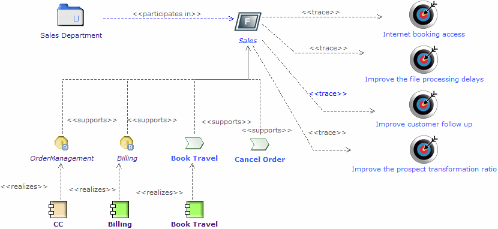 +
*Business footprint diagram focused on the "sales" function*

Elements used: "support" links between services or processes and functions, participation links between organization units and functions, traces between functions and goals.

[cols=",",options="header",]
|===========================================================================================================================================================================================================================================
|Togaf elements |description
|image:images/Modeling_Business_modeling_image029.gif[image] |*Business service:* Represents a service provided by the business, which may then be realized by one or more IS services.
| |*Function:* Describes one function of the organization.
| |*Entity application component:* An entity component is frequently derived from business entities, and is responsible for managing the access to the entity, and its integrity.
| |*Process application component:* A process application component is responsible for a business process execution. It orchestrates the tasks of the process.
| |*Organization unit:* Describes one unit that breaks down the organization of the enterprise. This can be, for example, a department.
| |*Business process:* As presented in process maps (event diagrams). The business process is detailed in flow diagrams.
|image:images/Modeling_Business_modeling_image033.gif[image] |*Supports link:* Determines that a service or process is supported by finer-grained elements such as other services or processes, or application elements.
| |*Participates in link:* Describes in which part or activity of the enterprise a participant intervenes.
| |*Trace link:* General purpose tracebility link. Determines that the origin of the trace has been founded on the trace destination during its definition.
| |*Component realization:* An application component realizes the designated element, for example a business process.
|===========================================================================================================================================================================================================================================

[[Business-serviceinformation-diagrams]]

[[business-serviceinformation-diagrams]]
===== Business service/information diagrams

The business service/information diagram shows the information needed to support one or more business services. The business service/information diagram shows what data is consumed or produced by a business service and may also show the source of information. The business service/information diagram shows an initial representation of the information present within the architecture and therefore forms a basis for elaboration and refinement within phase C (data architecture).

Drag and drop business services and business entities from the explorer, and draw "flow" dependencies between them to express inputs or outputs. Flow properties provide the means of specifying the input or output orientation.

*Note :* By using "flow" dependencies between business services and business entities, this diagram represents which kind of entity is used or produced by the services.

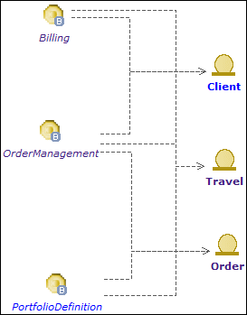 +
Three business services are based on four business entities

[cols=",",options="header",]
|===============================================================================================================================================================================================================
|Togaf elements |description
| |*Business entity:* Describes the semantics of the entities in the business, independently of any IS consideration (e.g. storage, technology, etc).
|image:images/Modeling_Business_modeling_image039.gif[image] |*Business service:* Represents a service provided by the business, which may then be realized by one or more IS services.
| |*Flow link:* Flow link between data (e.g. business entity, event, product) and active elements (e.g. business process, service).
|===============================================================================================================================================================================================================

[[Event-diagrams-also-called-ldquoprocess-mapsrdquo]]

[[event-diagrams-also-called-process-maps]]
===== Event diagrams (also called "process maps")

The purpose of the event diagram is to depict the relationship between events and process. Certain events, such as the arrival of certain information (for example, a customer submits a sales order) or a certain point in time (for example, the end of a fiscal quarter) cause work, and certain actions need to be undertaken within the business. These are often referred to as business

events or simply events, and are considered as triggers for a process. It is important to note that the event has to trigger a process and generate a business response or result.

Event diagrams provide an overview of processes, which helps in their mapping. Event diagrams present a general view of processes, trigger events, sent events, participating roles or organization units, as well as received or sent products. At this macroscopic level, there is no sequence between processes, even if we are able to see that the products sent by a process can be re-used by another process.

*Note :* Events are connected to processes through "flow" dependencies, roles can initiate or participate in processes, products can be connected to processes through "flow" dependencies.

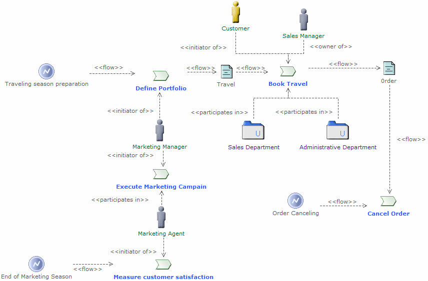 +
*Event diagrams provide an overview of business processes*

[cols=",",options="header",]
|========================================================================================================================================================================================================================
|Togaf elements |description
| |*External actor:* An actor that is external to the enterprise
| |*Internal actor:* An actor that belongs to the enterprise.
| |*Organization unit:* Describes one unit that breaks down the organization of the enterprise. This can be, for example, a department.
| |*Business process:* As presented in process maps (event diagrams). The business process is detailed in flow diagrams.
| |*Product:* A product is produced or consumed by business processes.
|image:images/Modeling_Business_modeling_image044.gif[image] |*Business event:* A business event triggers a business process or is generated by a business process.
| |*Information flow:* Defines the flow of any kind of information (business entity, event, product, informal, etc) between active entities of the enterprise.
| |*Participates in link:* Describes in which part or activity of the enterprise a participant intervenes.
| |*Participates in link:* Describes in which part or activity of the enterprise a participant intervenes.
| |*Initiator of link:* The origin participant initiates the designated process. It starts the process by realizing a task or activity in it.
|========================================================================================================================================================================================================================

[[Functional-decomposition-diagrams]]

[[functional-decomposition-diagrams]]
===== Functional decomposition diagrams

The purpose of the functional decomposition diagram is to show on a single page the capabilities of an organization that are relevant to the consideration of an architecture. By examining the capabilities of an organization from a functional perspective, it is possible to quickly develop models of what the organization does without being dragged into an extended debate on how the organization does it. Once a basic functional decomposition diagram has been developed, it becomes possible to layer heat-maps on top of this diagram to show scope and decisions. For example, the capabilities to be implemented during the different phases of a change program.

This diagram can be enriched using links to other parts of the model, to indicate, for example, which application supports which function, which role uses which function, and so on.

*Note :* Dedicated dependencies can be used to enrich the model, for example to indicate which application components support which function, which role uses which function, and so on. Function decomposition can be expressed by "containment" (simply create a function in another function), or by using the "part" dependency.

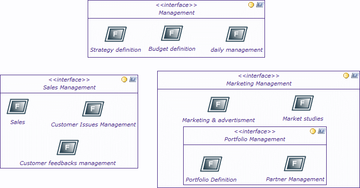 +
*Main functions of the DiscountTravel company*

The elements present in this diagram are essentially functions, which can be embedded or linked by "part" dependencies.

[cols=",",options="header",]
|====================================================================================================================
|Togaf elements |description
| |*Function:* Describes one function of the organization.
|====================================================================================================================

[[GoalObjectiveService-diagrams]]

[[goalobjectiveservice-diagrams]]
===== Goal/Objective/Service diagrams

The purpose of a Goal/Objective/Service diagram is to define the ways in which a service contributes to the achievement of a business vision or strategy.

Services are associated with the drivers, goals, objectives, and measures that they support, allowing the enterprise to understand which services contribute

to similar aspects of business performance. The Goal/Objective/Service diagram also provides qualitative input on what constitutes high performance for a particular service.

*Note :* Drag & drop business services and goals, and define "trace" dependencies between services and goals where appropriate.

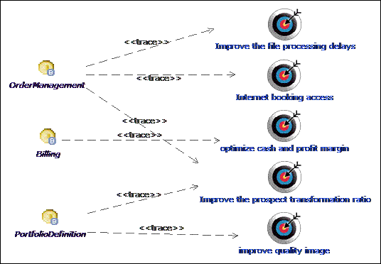 +
*Goal/Objective/Service diagram*

[cols=",",options="header",]
|==========================================================================================================================================================================================================
|Togaf elements |description
| |*Business service:* Represents a service provided by the business, which may then be realized by one or more IS services.
| |*Goal:* This is a goal or objective of the enterprise.
| |*General purpose traceability link:* Determines that the origin of the trace has been founded on the trace destination during its definition.
|==========================================================================================================================================================================================================

[[footer]]
