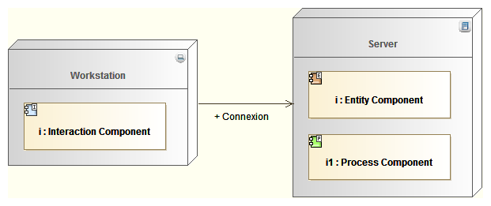
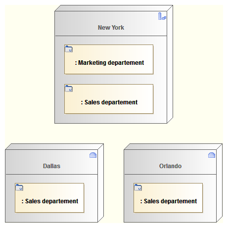

// Disable all captions for figures.
:!figure-caption:

// Hightlight code source and add the line number
:source-highlighter: coderay
:coderay-linenums-mode: table

[[Modeling-Enterprise-Architecture-modeling-with-Modelio]]

[[modeling-enterprise-architecture-modeling-with-modelio]]
= Modeling Enterprise Architecture modeling with Modelio

[[Togaf-model-elements-and-diagrams]]

[[togaf-model-elements-and-diagrams]]
===== Togaf model elements and diagrams

The Modelio explorer centralizes and organizes every model element created during modeling. Each model element can appear within one or several diagrams. Model elements can be created within the explorer, or within adapted kinds of diagrams, where a palette supports the creation of all pertinent elements. Any change applied to a model element will be transferred in each diagram where this element appears.

Within an enterprise architecture model, a model element very frequently appears in several diagrams. For example, the same actor can appear within an organization decomposition diagram, an event diagram, a data security diagram, a location diagram and many other types of diagrams.

In order to show an existing model element within a diagram, you just need to drag and drop it from the explorer to the targeted diagram.

*Rule :* Never create the same element twice. When created once, drag & drop it from the explorer to let it appear in another diagram.

[[Modeling-deployment]]

[[modeling-deployment]]
===== Modeling deployment

Deployment needs to be modeled mainly to represent the geographic distribution of a company, or to represent the application distribution on servers in the technology architecture. As a same model element can be deployed in several different places, an occurrence (instance) of the deployed element needs to be created in the deployment location element.

In Modelio, you can create an instance (or part) in the deployment location element, and then type that instance using the deployed element.

A simpler way to do this in Modelio is just to drag and drop the deployed element (from the explorer) into the deployment location (appearing in a diagram): an instance typed by the deployed element is automatically created.

.Deploying application components under hardware devices (workstation, server)

.There is a sales department in every location. The Marketing department is only in New York (headquarters)

[[footer]]
