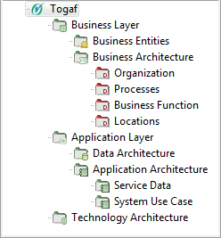

[[Model-Organization]]

[[model-organization]]
= Model Organization

The TOGAF architecture is organized within this structure:

* *Business Architecture* is defined in the Business Layer.
* *Data Architecture* is split between a business level, where the conceptual level of data is defined (Business Entities under "business layer/business entities"), and the technical level, where the model of persistent data is defined ("application level/data architecture"). At the "business entities" stage, the modeler is concerned with the concepts and their properties, but not with the logical and physical aspects such as repositories, relational models, etc. It is a recommended practice to model first the important notions of the business, and then to define the enterprise organization, the business processes, and other business architecture elements.
* *Application Architecture* is structured under "application layer/application architecture". It has two application domains: "service data" to model the data exchanged between business services and System Use Cases to model use cases related to the main application components of the IS.
* *Technology Architecture* is structured under the "technology architecture" technology domain.

[[Togaf-structure]]

[[togaf-structure]]
Togaf structure

[[footer]]
