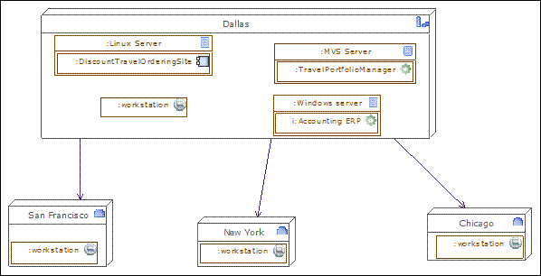
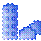
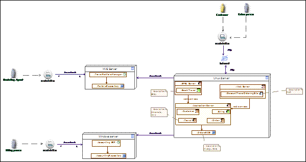
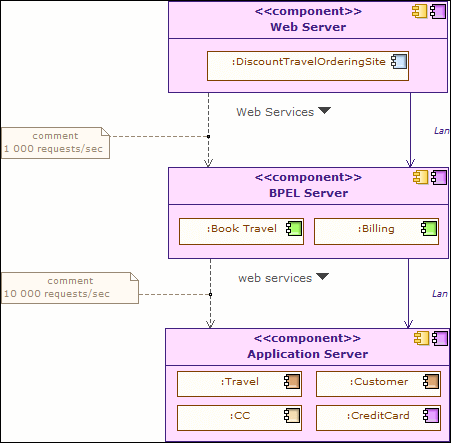

// Disable all captions for figures.
:!figure-caption:

// Hightlight code source and add the line number
:source-highlighter: coderay
:coderay-linenums-mode: table

[[Technology-modeling]]

[[technology-modeling]]
= Technology modeling

*Technology Architecture* describes the logical software and hardware capabilities that are required to support the deployment of business, data, and application services.This includes IT infrastructure, middleware, networks, communications, processing, standards, etc.

[[Technology-architecture-modeling]]

[[technology-architecture-modeling]]
=== Technology architecture modeling

Environments and locations diagrams

An environments and locations diagram depicts which locations host which applications, identifies which technologies and/or applications are used at which locations, and finally identifies the locations from which business users typically interact with the applications. This diagram should also show the existence and location of different deployment environments, including non-production environments, such as development and pre-production.

*Note :* Drag & drop the locations of the enterprise, then drag and drop the material (typically the servers) into the locations, and then drag & drop the application components or software elements into the material. Typically, this diagram represents where each server is located, and on which server which application is executed.

.The main applications and devices are located in Dallas

[cols=",",options="header",]
|=============================================================================================================================================================================================================================================================================
|Togaf elements |description
| |*Headquarter location:* Geographically defines where the elements of the enterprise are deployed (organization units, hardware devices, actors, etc).
| |*Site location:* Geographically defines where the elements of the enterprise are deployed (organization units, hardware devices, actors, etc). Generally, an enterprise has one headquarter and several sites.
| |*Server device:* Represents a hardware platform, that can be connected to other devices, and on which application components are deployed.
| |*Workstation:* Workstation are connected via network links to the IS. +
Application components can be deployed there.
| |*Application:* This application component corresponds to legacy applications, off the shelf products, or can be an assembly of application components.
|image:images/Modeling_Technology_modeling_image012.gif[image] |*Interaction application component:* Represents the top level components that manage the interaction with elements outside the IS. In most cases, it is a GUI component, such as here a web interface.
| |*Association between two classes:* An association has a name, and for each extremity provides the role name and cardinalities (possible number of occurrences) of related elements.
|=============================================================================================================================================================================================================================================================================

[[Network-computing-hardware-diagrams]]

[[network-computing-hardware-diagrams]]
===== Network computing hardware diagrams

Starting with the transformation to client-server systems from mainframes and later with the advent of e-Business and J2EE, large enterprises moved

predominantly into a highly network-based distributed network computing environment, with firewalls and demilitarized zones. Currently, most applications have a web front-end, and looking at the deployment architecture of these applications, it is very common to find three distinct layers in the network landscape: a web presentation layer, a business logic or application layer, and a back-end data store layer. It is a common practice for applications to be deployed and hosted in a shared and common infrastructure environment. Therefore, it becomes highly critical to document the mapping between logical applications and the technology components (for example, servers) that support the application both in the development and production environments. The purpose of the network computing hardware diagram is to show the deployed logical view of logical application components in a distributed network computing environment.

This diagram presents the hardware (servers, workstations) that are interconnected by a network, as well as the technical and application components that are deployed on this hardware.Technical, architectural components such as web servers are added to the logical components identified in the application architecture. In this diagram, occurrences of application components are represented inside server devices, to show their deployment. Network interconnections are represented by associations between servers.

*Note:* Create workstations and servers and connect them using network devices and associations. Then deploy application components by dragging & dropping them into workstations and servers. You can also link roles or actors to their environment.

.This diagram shows where application components are deployed, how the computers are networked, and so on

[cols=",",options="header",]
|=================================================================================================================================================================================================================================================================================================================
|Togaf elements |description
| |*Server device:* Represents a hardware platform, that can be connected to other devices, and on which application components are deployed.
| |*Workstation:* Workstations are connected via network links to the IS. Application components can be deployed there.
| |*application component:* A process application component is responsible for a business process execution. It orchestrates the tasks of the process.
| |*Entity application component:* An entity component is frequently derived from business entities, and is responsible for managing the access to the entity, and its integrity.
|image:images/Modeling_Technology_modeling_image014.gif[image] |*Utility component:* Represents an application component that is frequently reused, and most of the cases bought off the shelf.
|image:images/Modeling_Technology_modeling_image012.gif[image] |*Interaction application component:* Represents the top level components that manage the interaction with elements outside the IS. In most cases, it is a GUI component, such as here a web interface.
| |*Database application component:* This represents a repository. In pure SOA architecture, these elements should not appear. However, for legacy analysis or technology architecture, modeling repositories or repository deployment can be useful.
| |*Application:* This application component corresponds to legacy applications, off the shelf products, or can be an assembly of application components.
| |*Internal actor:* An actor that belongs to the enterprise.
| |*Association between two classes:* An association has a name, and for each extremity provides the role name and cardinalities (possible number of occurrences) of related elements.
|=================================================================================================================================================================================================================================================================================================================

[[Processing-diagrams]]

[[processing-diagrams]]
===== Processing diagrams

The processing diagram focuses on deployable units of code/configuration and how these are deployed onto the technology platform. A deployment unit represents a grouping of business functions, services, or application components. The processing diagram addresses the following questions:

* Which set of application components needs to be grouped to form a deployment unit?
* How does one deployment unit connect/interact with another (LAN, WAN, and the applicable protocols)?
* How do application configuration and usage patterns generate load or capacity requirements for different technology components?

See network computing hardware diagram. Processing diagrams will use deployment in a more generic way, in order to present deployment units. Deployment units can be presented as component instances where application components are deployed, or as physical utility components that will host the deployed application component (for example, an application server).

Associations between these deployment units will represent the connection (for example, a network), while information flows will indicate the nature of the information being exchanged. In these diagrams, indications about capacity requirements are provided.

*Note :* Drag & drop application components to deploy them into the deployable units of configuration, which are themselves specific kinds of application components, at a logical technology level.

.This processing diagram shows how application components are deployed under the different kinds

[cols=",",options="header",]
|==================================================================================================================================================================================================================================================
|Togaf elements |description
| |*Entity application component:* An entity component is frequently derived from business entities, and is responsible for managing the access to the entity, and its integrity.
| |*Process application component:* A process application component is responsible for a business process execution. It orchestrates the tasks of the process.
|image:images/Modeling_Technology_modeling_image014.gif[image] |*Utility component:* Represents an application component that is frequently reused, and most of the cases bought off the shelf.
| |*Information flow:* Defines the flow of any kind of information (business entity, event, product, informal, etc) between active entities of the enterprise.
| |*Association between two classes:* An association has a name, and for each extremity provides the role name and cardinalities (possible number of occurrences) of related elements.
|==================================================================================================================================================================================================================================================

[[footer]]
