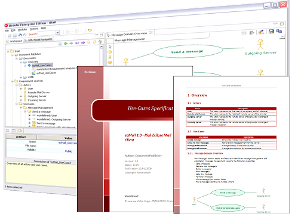

// Disable all captions for figures.
:!figure-caption:

// Hightlight code source and add the line number
:source-highlighter: coderay
:coderay-linenums-mode: table

[[Catalog-and-documentation-generation-tools]]

[[catalog-and-documentation-generation-tools]]
= Catalog and documentation generation tools

[[Documentation-generation]]

[[documentation-generation]]
=== Documentation generation

*Note:* You need to have the Modelio Document Publisher Module to benefit from this documentation generation feature.

With Togaf Architect, you can generate documentation catalogs in docx or HTML format from a Togaf model.

To use this functionality:

* Select the model element(s) that you want to document
* Run the generation command corresponding to the catalog that you want to generate : "Togaf Architect > Catalog > ...".
* Select the destination directory and the expected format: HTML or OPENXML (docx).

*Note :* This feature requires that the Togaf Architect and Document Publisher modules be used together. The Document Publisher module provides model-based documentation generation services. For more information on Document Publisher, please refer to the user guide for this module.

[[List-of-catalogs-provided]]

[[list-of-catalogs-provided]]
=== List of catalogs provided

*Organization/Actor catalog:* Listing of all participants that interact with IT, including users and owners of IT systems. Can be referenced when developing requirements for completeness checks.

*Driver/Goal/Objective catalog:* Publishing a definitive breakdown of drivers, goals, and objectives allows change initiatives within the enterprise to identify synergies across the organization (e.g., multiple organizations attempting to achieve similar objectives), which in turn allows stakeholders to be identified and related change initiatives to be aligned or consolidated.

*Role/Actor Catalog:* Provides a listing of all authorization levels or zones within an enterprise. Frequently, application security or behavior is defined against locally understood concepts of authorization that create complex and unexpected consequences when combined on the user desktop.

*Business Service/Function Catalog:* Provides a functional decomposition in a form that can be filtered, reported on, and queried, as a supplement to graphical Functional Decomposition diagrams.

*Location Catalog:* Provides a listing of all locations where an enterprise carries out business operations or houses architecturally relevant assets, such as data centers or end-user computing equipment.

*Process/Event/Control/Product Catalog:* Provides a hierarchy of processes, events that trigger processes, outputs from processes, and controls applied to the execution of processes. This catalog provides a supplement to any Process Flow diagrams that are created and allows an enterprise to filter, report, and query across organizations and processes to identify scope, commonality, or impact.

*Business Entities Catalog:* Provides a set of information relative to data management at Business level.

*Information Service Catalog:* Provides a list of all services exposed by the different components of the Application Architecture model.

*Component catalog:* Provides a set of information relative to the components of the Application Architecture model.

*Service Data Catalog:* Provides a set of information relative to data management at Architecture level.

[[footer]]
